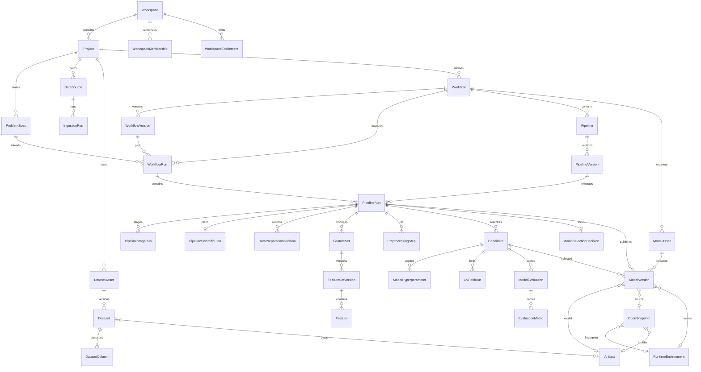

# DCLab database ERD

Logical model at Alembic head `0039_scientific_plans`. Physical table names
that differ from the logical noun are noted in parentheses.

PipelineRun is the `experiments` table. Candidate is `experiment_candidates`.
`PipelineScientificPlan` is `pipeline_scientific_plans` (one row per run).
`RuntimeEnvironment` is a globally reusable fingerprint. The dependency-lock
Artifact is workspace-owned and referenced from `CodeSnapshot`.

## Compatibility and legacy (not first-class Project children)

| Table | Classification | Project FK |
| --- | --- | --- |
| `experiments` | Canonical compatibility table (PipelineRun) | nullable, backfilled |
| `experiment_candidates` | Canonical compatibility table (Candidate) | nullable, backfilled |
| `client_lab_uploads` | Labs adapter into DataSource/Ingestion/Dataset | via dataset/experiment |
| `opportunities` / `predictions` / `decisions` | Legacy product-scoring path, still written | workspace only |
| `client_lab_runs` / `client_lab_run_audits` | Legacy catalog trials | workspace only |
| `environments` / `prediction_tasks` | Legacy Lab execution containers | none |

See `docs/DCLAB_DATABASE_MIGRATION_MAP.md` for backfill rules.

## Object storage

`artifacts` is registry metadata only (`provider` in `local`, `s3`, `gcs`).
The blob is addressed by `object_key` + `content_digest`.
