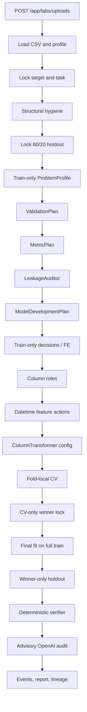

# DCLab Pipeline Deep Dive

This document describes the implemented automatic tabular pipeline
(`open_ingest`) as executed by `run_auto_train_job` in
`apps/api/app/services/auto_train_service.py`, with candidate search in
`apps/api/app/engine/experiments/runner.py` and structural hygiene in
`apps/api/app/engine/lab/auto_prepare.py`.

Statuses below are implementation facts, not product claims. Production Labs
creates one pipeline per WorkflowRun. Schema uniqueness on
`(workflow_run_id, pipeline_index)` allows several pipelines; Labs does not
orchestrate that automatically.

## 1–15 Ingestion, profiling, and target lock

1. **Upload entrypoint.** `POST /app/labs/uploads` in `client_labs.py` returns
   immediately with `run_id` and queues `run_auto_train_job`.
2. **Workspace binding.** `save_upload` writes `ClientLabUpload.workspace_id`
   from the validated request workspace, not from the client body.
3. **File load.** `_load_upload_frame` reads the stored path. Empty frames fail
   the run.
4. **Column names.** Columns are stringified before profiling.
5. **Row provenance column.** `__dclab_source_row__` is added only after
   duplicate detection in `structural_clean_frame`.
6. **Profiling.** `profile_frame` records dtypes, missingness, uniqueness, and
   constants onto the technical report.
7. **Quality report.** `quality_report` is persisted for admin evidence, not
   shown on `/app`.
8. **Numeric-like coercion.** `coerce_numeric_like` converts a column only when
   ≥90% of non-null values parse as numbers.
9. **Invalid string sentinels.** Empty/`NA`/`null`/`?` tokens become missing on
   feature columns before the split.
10. **Infinite values.** Numeric infinities become NA during structural hygiene.
11. **Target resolution.** `resolve_target_selection` uses the explicit upload
    target when present; otherwise a deterministic chooser plus optional
    semantic LLM.
12. **Supported tasks.** Binary and regression only. Other inferred types fail.
13. **Binary encoding.** `coerce_binary_target` maps yes/no/true/false/0/1.
    Unusable labels are dropped.
14. **Task spec.** `upsert_task` persists `TaskSpec` with column roles filled
    later from train-only evidence.
15. **Minimum rows.** `MIN_TRAIN_ROWS = 40`. Smaller files are skipped, not
    trained.

## 16–30 Split, leakage, and train-only decisions

16. **Holdout lock.** After structural cleaning, `plan_holdout` selects one
    `HoldoutPlan` from pre-split structure (stratified random, random,
    group-disjoint, temporal future, or unsupported). `split_train_test_holdout`
    consumes that plan. Group holdout has zero entity overlap. Temporal
    holdout is the latest chronological slice. Grouping plus strong time
    structure fails closed. Seed 42, requested test size 0.2.
17. **Disjoint provenance.** Train and test source-row sets are persisted and
    must not overlap.
18. **Replay of the split.** Repeating the split after the prepared table is
    stored must reproduce the same test source rows; auto-train asserts this.
19. **Structural-only pre-split.** Duplicate drop, sentinel cleanup, and
    numeric-like parse are allowed on the full frame.
20. **Forbidden pre-split learning.** Median/mode imputation, identifier
    drops, column-role LLM evidence, and leakage screens use training rows
    only after the split.
21. **Missing-value plan.** `plan_missing_values` plus
    `record_missing_value_decisions` record train-only evidence rows.
22. **Semantic missing-value LLM.** When used, `create_llm_invocation` purpose
    is `semantic_missing_value` and mode is `semantic_decision`.
23. **LLM used: NO.** Sufficient deterministic evidence records
    `LLM used: NO — deterministic evidence was sufficient.`
24. **Column roles.** `infer_column_roles` / `split_column_roles` exclude the
    target and identifiers from modeled features.
25. **Semantic column-type LLM.** Purpose `semantic_column_type`, same mode
    constraint as other semantic purposes.
26. **Datetime features.** `encode_datetime_columns` converts date-like
    columns to unix seconds; the action is recorded as
    `datetime_to_unix_seconds`.
27. **Feature actions are not generated features.** No model-invented columns.
    Only declared transforms.
28. **Preprocessor.** `build_preprocessor` is a `ColumnTransformer`: numeric
    median imputer + scaler; categorical most-frequent imputer + one-hot
    (`handle_unknown=ignore`).
29. **Fit partition.** Preprocessing is fit inside each CV fold on that fold’s
    training rows, never on holdout.
30. **Unknown categories.** One-hot unknown categories become all zeros; this
    is a warning in sklearn, not a leakage path.

## 31–45 Candidates and cross-validation

31. **Families.** Open-ingest uses the registered families from
    `available_families` (logistic regression, random forest, and XGBoost when
    installed).
32. **Candidate identity.** `ExperimentCandidate.candidate_key` plus
    fingerprint uniquely identify a trial inside a pipeline. Open-ingest
    fingerprints include dataset version, feature set, model family,
    hyperparameters, preprocessing config, holdout/validation plan
    version and strategy, primary metric, and model-development-plan version.
33. **Isolation.** Each candidate trains independently. A forced family
    failure emits `candidate_failed` and does not hide other candidates.
34. **CV splitter.** Open-ingest uses the Adaptive Model Builder
    `ValidationPlan`: ordinary binary `StratifiedKFold`, ordinary regression
    `KFold`, repeated identifier-like entities group-aware CV, strong temporal
    structure `TimeSeriesSplit`. See [DCLAB_ADAPTIVE_MODEL_BUILDER.md](DCLAB_ADAPTIVE_MODEL_BUILDER.md).
35. **Adaptive folds.** Too-few training rows reduce fold count; the reason is
    persisted on the candidate.
36. **Fold provenance.** Each fold stores train/validation source rows and
    counts.
37. **Fold disjointness.** Verifier
    `cross_validation_provenance` fails if a fold mixes holdout rows or
    overlaps train/validation.
38. **Fresh sklearn Pipeline.** `_run_open_ingest_candidates` builds a new
    `SkPipeline` per fold (`clone` of preprocessor + estimator).
39. **No holdout in CV.** Fold matrices are built from training provenance
    only.
40. **Metrics.** Binary uses PR-AUC (and related classification metrics);
    regression uses the task evaluation metric.
41. **CV mean/std.** Winner ranking uses CV mean, not holdout.
42. **Events.** `cv_fold_completed` events are append-only with sequence
    numbers.
43. **Capability `cv_fold_details`.** Business monitor hides fold events when
    the flag is off.
44. **Failed candidate status.** Status `failed` plus reason is persisted;
    those candidates cannot be published.
45. **Expected portfolio.** Verifier `candidate_audit_complete` checks every
    expected candidate has a trained or failed record.

## 46–60 Winner lock, final fit, predictions, lineage

46. **CV-only selection.** `selection_source` must be `cross_validation`.
47. **Lock before holdout.** `locked_at` must precede final-fit timestamps.
48. **Exactly one winner holdout.** Rejected candidates have no
    `test_metrics`; verifier `winner_only_final_test` fails otherwise.
49. **Final fit partition.** Full locked training set, not including holdout.
50. **Prediction rows.** `_prediction_rows` stores `source_row_index`,
    `y_true`, `y_pred`, and scores.
51. **Label comparison.** Deterministic verifier compares `y_true` to the
    input artifact after the same binary/regression coercion used in training.
52. **Prediction count.** Must equal `n_test` and the test provenance set.
53. **Artifacts.** Input, model, result JSON, and prediction CSV paths are
    verified to exist.
54. **Dataset immutability.** ORM `before_update`/`before_delete` on
    `Dataset` rejects mutation.
55. **ModelVersion immutability.** Same ORM protection; publish a new version.
56. **Publication gate.** `create_model_version` rejects non-`COMPLETED`
    pipelines and `failed`/`rejected` candidates.
57. **Lineage FKs.** Workspace → domain → workflow → workflow run → experiment
    → candidate / model version.
58. **Cross-tenant bind.** `LineageError` if dataset, domain, or workflow
    belongs to another workspace.
59. **Repeated uploads.** Same bytes create a new `WorkflowRun` and
    `ClientLabUpload`.
60. **Multi-pipeline schema.** Unique `(workflow_run_id, pipeline_index)`.
    Production Labs still writes one pipeline.

## 61–75 Verification, observability, LLM

61. **Authoritative verifier.** `PipelineVerifier.verify` does not trust the
    run status label.
62. **Conservative aggregate.** Any FAIL makes overall FAILED; missing
    evidence is NOT_VERIFIABLE, never silently PASS.
63. **Advisory OpenAI.** `request_pipeline_verification` cannot upgrade a
    deterministic FAIL to VERIFIED.
64. **Luna routine.** Default model `gpt-5.6-luna`, purpose
    `pipeline_audit_routine`, mode `routine`.
65. **Terra deep.** Model `gpt-5.6-terra`, purpose `pipeline_audit_deep`,
    mode `deep`. Business deep audit needs write + `openai_pipeline_audit` +
    `deep_audit`.
66. **Purpose/mode coupling.** `create_llm_invocation` rejects semantic
    purposes without `semantic_decision` mode and audit purposes without an
    audit mode.
67. **Evidence digest.** SHA-256 of the bounded evidence package; raw evidence
    is not stored on the invocation.
68. **Redaction.** Secret keys, `sk-`/`Bearer` strings, emails, phones, raw
    rows, and provenance arrays are stripped before persist.
69. **Payload cap.** Observability JSON over 32 KiB is replaced with a digest
    stub.
70. **Append-only events.** ORM listeners plus PostgreSQL trigger
    `ml_run_events_append_only`.
71. **Sequence allocation.** `SELECT MAX(sequence) FOR UPDATE` on the
    experiment row.
72. **Replay.** Incremental `after_sequence` returns only later events;
    order is stable across refreshes.
73. **Business observatory.** `/business/observatory` requires Business
    administration membership and a resolved workspace; `client_user` is 403.
74. **Monitor preprocessing.** `get_pipeline_monitor` copies persisted
    `technical_report.preprocessing`; it does not invent fit guarantees.
75. **Reports capability.** `decision_ledger` strips `decision_records` from
    the combined monitor and hides the Reports panel in the UI.

## 76–90 Tenancy, UI, operations, limitations

76. **Four modern roles.** `dclab_admin`, `dclab_developer`,
    `business_admin`, `business_developer`.
77. **Legacy `client_user`.** Compatibility write on `/app`; excluded from
    `/business`.
78. **JWT vs membership.** UI middleware reads JWT `role`; backend
    memberships are authoritative.
79. **No `X-Workspace-Id` from the web client.** Single-membership users
    resolve via `users.workspace_id`.
80. **Capabilities fail closed.** Missing row equals disabled for modern
    business roles. Platform roles bypass flags.
81. **`model_management`.** Gates Business model detail and strips the model
    list. No create/update/delete model API exists.
82. **Dynamic domains.** Catalog rows, not migrations. `operations` can be
    inserted and enabled/disabled; re-enable sets `enabled=True` on the
    existing link.
83. **Object denial.** Cross-tenant ID under another workspace URL is 404.
84. **Read-only developers.** Unsafe `/admin` and `/app` methods are 403.
    `/business` deep audit is 404/403 for non-writers on unknown objects.
85. **Client Labs UI.** `/app/labs` and `/lab/runs/{id}` still use a
    processing checklist; they are not the Pipeline Monitor.
86. **Admin upload IA.** `/admin/models/client-uploads/{id}` remains the
    staff upload detail path.
87. **Parallel Organizations.** `/admin/organizations` still exists beside
    Workspace-as-Business.
88. **Tests vs migrations.** Default pytest uses `Base.metadata.create_all`,
    not Alembic; trigger coverage lives in
    `test_ml_run_events_postgres_enforcement.py`.
89. **DOCX.** Generated from the canonical JSON report; LibreOffice visual
    render is `NOT_TESTED` unless the binary is present.
90. **Live provider.** Luna/Terra use the official OpenAI Responses parse
    path. When the key works, smoke, synthetic Terra, and persisted-run
    routine/deep audits record only provider, model, status, latency, and
    evidence digest.

## Implementation map

| Concern | Primary symbols |
| --- | --- |
| Orchestration | `run_auto_train_job` |
| Hygiene / roles / preprocessor | `structural_clean_frame`, `plan_missing_values`, `infer_column_roles`, `build_preprocessor` |
| CV and winner | `_run_open_ingest_candidates`, `_run_open_ingest_experiment` |
| Split | `plan_holdout`, `split_train_test_holdout` |
| Verifier | `PipelineVerifier.verify` |
| Advisory LLM | `request_pipeline_verification`, `OpenAIPipelineAuditProvider.audit` |
| Events | `append_ml_run_event`, `create_llm_invocation` |
| Lineage | `lineage_service.create_*` |
| Business plane | `business_explorer.py`, `workspace_capability_service.py` |
