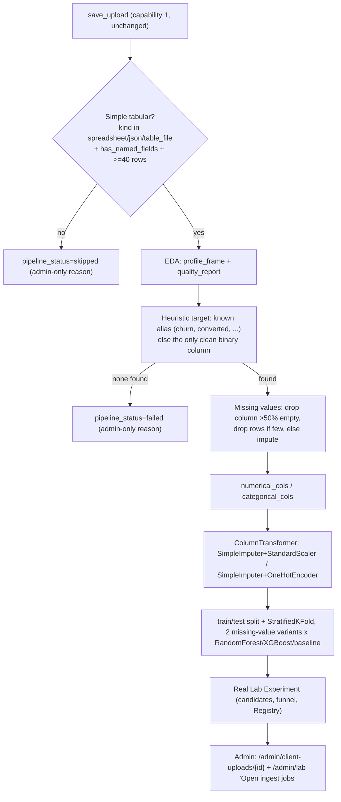

# Client Labs — open files and data understanding

Two capabilities, plus an automatic training job that runs behind capability 1
for simple files. Only capability 2 remains undone.

This is **not** a Client Labs trial run. Saving a file here does **not** consume
trial quota and does **not** create a `ClientLabRun` / `ClientLabRunAudit`. For
simple named-column tables, an admin-only auto-train job may still create a
real Lab `Experiment` behind the scenes — the client never sees that. The
problem cards below each category still require matching columns (or sample
data) to run a trial.

---

## Capability 1 — take the file (done)

On `/app/labs`, each business category has a **No template required** box above
the trial problem cards.

A signed-in client (or an admin supporting that workspace) can upload a usual
data file **without a required schema**. Raw logs with no field names are
accepted.

| Accepted now | How we treat it |
|---|---|
| `.csv`, `.tsv`, `.tab` | Spreadsheet. Named fields are listed when the first row looks like headers. |
| `.json`, `.jsonl`, `.ndjson` | JSON records (array, `{records\|data\|rows\|items}`, or one object per line). |
| `.parquet`, `.pq` | Table file via pyarrow. |
| `.xlsx`, `.xls` | Excel. If the grid cannot be read, the file is still saved. |
| `.txt`, `.log`, `.text` | Plain text / raw log. One record per non-empty line. Delimited logs with more than one column are treated as a spreadsheet. |
| No suffix | Sniffed as JSON, spreadsheet, or plain text. |

Bounds: **500 rows noticed**, **2 MB**. Empty files and unknown types (images,
archives, binaries that are not a data file) are rejected with a client-safe
message.

What the client sees: filename, kind, row count if we could count records, and
any **named fields we noticed**. Disk path is never returned. `structured` is
always `false` until capability 2 exists.

Code:

- Preview: `apps/api/app/engine/lab/open_ingest.py`
- Persist: `apps/api/app/services/client_lab_upload_service.py` → `client_lab_uploads`
- HTTP: `POST /app/labs/uploads`, `GET /app/labs/uploads`
- UI: `apps/web/app/app/labs/page.tsx` (`OpenFileCard`)

---

## Simple-case auto-train (admin-only, done)

**This is not capability 2.** It does not read raw logs, does not infer field
meaning with an LLM or a reading pipeline, and does not touch anything the
client sees. It is a plain automatic **training** job for files that are
*already* structured enough to model: named columns, one row per record.

After `save_upload` persists the file and returns the capability-1 response
above, it enqueues a background job (`enqueue_auto_train`, its own DB session
so the upload request is never blocked):

Gate, decisions, and models exactly match the sklearn workflow this was
modeled on (`SimpleImputer` → `StandardScaler`/`OneHotEncoder` →
`ColumnTransformer` → `train_test_split` + K-fold → `RandomForest`/`XGBoost`).
Every decision is heuristic and logged — nothing is ever asked of the client
or the admin at upload time.

Code:

- Pure decision functions: `apps/api/app/engine/lab/auto_prepare.py` (numeric
  coercion, target heuristic, missing-value plan, column roles, preprocessor)
- Orchestration + background thread: `apps/api/app/services/auto_train_service.py`
- New search strategy `open_ingest` (`apps/api/app/engine/search/generator.py`)
  and its runner path (`_run_open_ingest_candidates` in
  `apps/api/app/engine/experiments/runner.py`) — the **only** strategy that
  uses the `ColumnTransformer`; the default `use_case`/`progressive` strategy
  used by manual `/admin/lab` trains is untouched.
- Data model: `client_lab_uploads.pipeline_status` / `pipeline_log` /
  `experiment_id` (Alembic `0011_client_lab_upload_pipeline`) — admin-only
  columns, never on `ClientLabUploadRead`.
- Admin API: `GET /admin/client-uploads`, `GET /admin/client-uploads/{id}`
  (`apps/api/app/api/admin_client_uploads.py`).
- Admin UI: `apps/web/app/admin/models/client-uploads/[id]/page.tsx` (full
  detail) and an "Open ingest jobs" list on `apps/web/app/admin/lab/page.tsx`.

Persistence: a real `Experiment` (candidates, funnel, artifacts, Registry
`source=experiment`) via `ingest_dataset` / `upsert_task` / `create_experiment`
/ `execute_experiment` — **never** a `ClientLabRun` / `ClientLabRunAudit` (those
are the translated, quota-bound trial cards from `POST /app/labs/runs`). This
job does not consume trial quota and never produces a `ClientFacingInsight`.

`pipeline_status` values: `not_applicable` (upload predates this feature),
`queued`, `running`, `completed`, `skipped` (not a simple tabular file — file
is still saved and listed on `/app`), `failed` (ran but couldn't find a target
or ran out of usable columns — admin-only reason, never surfaced to `/app`).

## Capability 2 — understand and structure the file (TODO)

**Do not implement yet.** The right design is still open. The product need is:
even if the client dumps raw logs or a messy export with no headers, DCLab
should recover a table and assign fields / attributes we can use later.

Two tracks to develop — both are required research, not a pick-one shortcut.

### Track A — language tools (LLMs)

Goal: given a sample of the file (headerless CSV, JSON blob, log lines), propose:

- record boundaries
- field names in business language (not engine jargon)
- types (amount, date, id, free text, …)
- a short mapping the client can accept or rename

Constraints when this ships:

- Client-facing copy still goes through `app.translation` / banned-term scan.
- Do not send the whole workspace dump to a vendor by default; sample + opt-in.
- Human confirm step before anything is treated as a trial dataset.
- Never call this “feature engineering” on `/app`.

Open questions: which model, where it runs, how we store the proposed mapping,
how we cap cost, what happens when the guess is wrong.

### Track B — DCLab reading pipeline (your methods)

Goal: a deterministic pipeline that understands raw data **without** an LLM:

- encoding / delimiter / header detection
- log pattern splitting (timestamp, level, key=value, JSON-in-line)
- type inference and id-like column detection
- optional join of multi-file drops in one category

This is the path that should stay inspectable on `/admin` (full detail) while
the client only sees the resulting fields and a plain-language summary.

Open questions: how this composes with Track A (pipeline first, language tools
only on leftovers vs. the reverse), how we version a mapping, how we re-run
when the client uploads a second file in the same category.

### Explicitly out of scope until capability 2 ships

- Forcing clients onto the trial-problem column lists for this box
- Auto-running a **translated, quota-bound** Lab trial (`ClientLabRun`) or a
  monitoring `SimulationRun` from an open ingest — the simple-case auto-train
  job above is a plain admin-only `Experiment`, not either of these
- Returning engine metrics, candidate lists, or raw column maps on `/app`
- Reading raw logs or headerless files at all (simple-case auto-train only
  ever runs on already-named-column files; see the gate above)

When you pick up this work: start here, then add an admin-visible mapping
object (not a `ClientLabRunAudit` unless a real engine run happens). Update
`ACCESS_MODEL.md` §6 and `KNOWN_CLIENT_OPERATIONS` if new `/app` routes appear.
