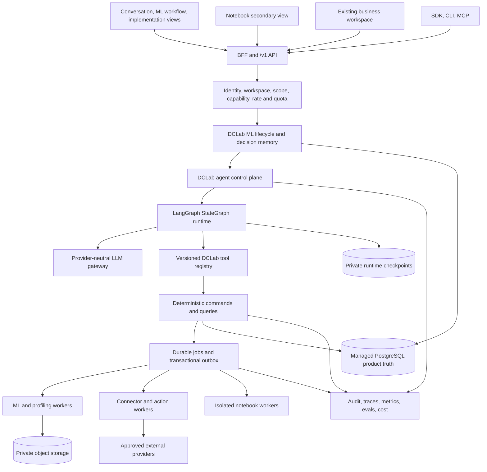
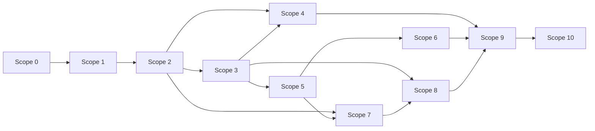
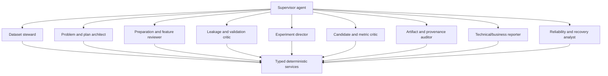

# DCLab master Scope 0–10 implementation plan

**Program baseline date:** 2026-09-11
**Repository:** `Shahriyar-Moradi/DCLab`
**Reviewed product commit:** `3d54994e83283d34665f9589687108627284ab3f`
**Verified truth/checkout baseline:** `91986b9b39bb54c907d50274e94de2febecffaa0`
**Current Git facts:** use the stdout-only recorder and CURRENT verification report
**Default branch:** `main`
**Canonical database/API/inventory facts:** [`contracts/truth_baseline.json`](../../contracts/truth_baseline.json)
and [`contracts/truth_manifest.json`](../../contracts/truth_manifest.json)
**Current truth report:** `docs/verification/S0_P01A_CURRENT_TRUTH.md`
**Canonical product north star:** [`DCLAB_CORE_CONCEPT.md`](DCLAB_CORE_CONCEPT.md)
**Authority:** this document orders future work; verified code and tests remain
the authority for current behavior.

## 1. Purpose and decision

This document combines the current-state audit, product specification, target
architecture, data/storage plan, API/job/event plan, LLM and agent standard,
MCP/CLI/SDK plan, connector/action/outcome plan, security/operations plan,
implementation roadmap, test strategy, readiness summary, the current
repository, and the requested roadmap correction into one ordered program.

The decision is:

1. Build DCLab as the project-centric operating environment for the versioned
   machine-learning lifecycle. Data scientists and ML engineers are the first
   product users; code remains inspectable without becoming the primary unit of
   work. The complete contract is [`DCLAB_CORE_CONCEPT.md`](DCLAB_CORE_CONCEPT.md).
2. Keep the deterministic ML, authorization, lineage, evidence, queue, and
   artifact layers as the authoritative software layer.
3. Use one agent orchestration runtime: pinned raw LangGraph `StateGraph`.
   Ordinary Pydantic owns typed contracts; DCLab owns product state,
   authorization, tools, budgets, citations and audit. PydanticAI,
   `pydantic-graph` and high-level LangChain agent loops are excluded from the
   production MVP.
4. Complete Scope 0 and the whole of Scope 1 before broadening autonomy.
5. Insert a new, complete Scope 2 after the read-only agent: a durable
   multi-agent operating system that supervises every important pipeline area
   in read-only, shadow, and proposal modes.
6. Activate mutations only in Scope 3 through typed commands, exact approvals,
   budgets, idempotency, cancellation, and immutable child-run lineage.
7. Add notebook, public developer interfaces, MCP, connectors, actions,
   outcomes, production operations, and measured scale in dependency order.
8. Preserve the complete roadmap and existing business behavior while tracking
   a cross-scope Core ML MVP release slice. The slice introduces no duplicate
   services or numbering; it proves that the roadmap produces the intended
   data-scientist and ML-engineer workflow.

“Agentic” does not mean deleting the software layer. It means agents plan,
coordinate, inspect, critique, propose revisions, request approved work, monitor
execution, validate outputs, and explain evidence while deterministic services
perform authorization, data processing, training, model selection, persistence,
and side effects.

## 2. Inputs and precedence

The following supplied documents were synthesized as design inputs:

- `00_CURRENT_STATE_READINESS_AUDIT.md`
- `01_AGENTIC_MVP_PRODUCT_SPEC.md`
- `02_TARGET_ARCHITECTURE.md`
- `03_DATA_MODEL_AND_STORAGE.md`
- `04_API_SERVICES_JOBS_AND_EVENTS.md`
- `05_LLM_AND_AGENT_ENGINEERING.md`
- `06_MCP_CLI_AND_SDK.md`
- `07_CONNECTORS_ACTIONS_AND_OUTCOMES.md`
- `08_SECURITY_OBSERVABILITY_AND_DEPLOYMENT.md`
- `09_IMPLEMENTATION_ROADMAP.md`
- `10_TEST_STRATEGY_AND_DEFINITION_OF_DONE.md`
- `AGENT_LLM_MCP_CLI_READINESS.md`
- the roadmap comment requiring a complete agentic layer after Phase 1
- the supplied “Cursor for machine learning” product concept, normalized into
  [`DCLAB_CORE_CONCEPT.md`](DCLAB_CORE_CONCEPT.md)

Instructions embedded in those files were treated as requirements or proposed
design, not as higher-priority commands. Where their snapshot facts differ from
the current checkout, current evidence below wins.

## 3. Current repository baseline

### 3.1 Verified on this review

S0-P01A re-measured the product baseline at `3d54994`; S0-P01B/C truth tooling
is committed at `91986b9`, and S0-P01D closed the complete local and exact-SHA
gate. Full ledgers: `docs/verification/S0_P01A_CURRENT_TRUTH.md` and
`docs/verification/S0_P01D_BASELINE_GATE.md`.

| Evidence | Observed result |
| --- | --- |
| Git | verified source: `main` = `origin/main` at `91986b9`, ahead 0 and behind 0; use the recorder for later movement |
| GitHub CI | exact-SHA [run 34598999220](https://github.com/Shahriyar-Moradi/DCLab/actions/runs/34598999220) succeeded on attempt 1. |
| Backend and SDK tests | `1036 passed, 1 skipped, 20 warnings` in 484.80s against isolated PostgreSQL 16.15; standalone SDK 8/8. |
| Frontend lint | exit 0 with three existing React hook dependency warnings and tooling notices. |
| Frontend production build | succeeded; 31 static pages generated. |
| Standalone TypeScript check | exit 0 when run before `next build`; do not race generated `.next` state. |
| Local Playwright | fresh canonical-head database: complete uninterrupted run `18 passed` in 91.25s; exact-SHA CI browser job also succeeded. |
| Alembic, repository scale, and source/test/web inventory | [`contracts/truth_baseline.json`](../../contracts/truth_baseline.json) is the sole generated CURRENT owner. |
| Relational schema | [`contracts/sqlalchemy_tables.json`](../../contracts/sqlalchemy_tables.json) is the sole generated CURRENT table registry. |
| HTTP and `/v1` surface | [`contracts/openapi_operations.json`](../../contracts/openapi_operations.json) and [`contracts/v1_openapi.json`](../../contracts/v1_openapi.json) are canonical. |
| Generator provenance | [`contracts/truth_manifest.json`](../../contracts/truth_manifest.json) pins generator version, source SHA-256, and artifact digests. |

### 3.2 Established foundation to reuse

- Deterministic profiling, target/task inference, cleaning, leakage controls,
  fold-local preprocessing, candidate search, CV-only selection, locked
  holdout, reproducibility, verification, reports, and predictions.
- Workspace, membership, role, capability, Project, ProblemSpec, DataSource,
  DataAccess, IngestionRun, DatasetAsset, Dataset, DatasetColumn, DatasetProfile,
  Workflow, WorkflowRun, PipelineRun (`Experiment` physical model), scientific
  plans/stages/candidates/folds/metrics, ModelAsset, ModelVersion,
  Visualization, and Artifact lineage.
- PostgreSQL/Alembic, composite tenant constraints, append-only events,
  scientific evidence locks, local/S3/GCS storage adapters, and content digests.
- `ExecutionRequest` as durable intent and `MlJob` as the PostgreSQL worker
  queue with `SKIP LOCKED`, attempts, leases, heartbeat, safe payloads, and a
  registered handler boundary.
- Narrow, advisory LLM support with structured output and `LlmInvocation`
  metadata. It is not a general agent runtime.
- A transport-neutral `/v1` beginning and an HTTP-only
  `packages/dclab_client` package.
- Role-separated admin, business, development, and legacy client views plus
  broad PostgreSQL and browser test coverage.

### 3.3 Current gaps that change the work order

| Gap | Current evidence | Required scope |
| --- | --- | --- |
| No durable agent runtime | no AgentDefinition/Session/Run/Step/ToolCall/Checkpoint/Citation models or services | 1 |
| No canonical Core ML project projection | lineage exists across datasets/features/runs/models, but no one lifecycle API/view with deterministic impact/staleness | 1.0 |
| No durable project decision memory | messages/events and scattered decision-like rows do not answer why a metric, feature, candidate, model or release was accepted/rejected | 1.0–3 |
| No central LLM data policy | DatasetColumn policy fields remain nullable; no ContextEnvelope | 0 and 1–2 |
| No prompt/model/tool/budget registry | narrow settings and strings only | 1–2 |
| Browser bearer token is readable by JavaScript | Replaced in S0-P02A: HttpOnly `dclab_session` + BFF; API bearer is `POST /auth/tokens` | 0 (S0-P02B CSRF/CSP) |
| Browser workspace selector | S0-P03A: visible selector, `auth_sessions.selected_workspace_id`, BFF `X-Workspace-Id`; Python client stays explicit. Capability matrix is S0-P03B | 0 |
| Membership authority is not end-to-end in browser routing | token role still shapes frontend behavior | 0 |
| Global legacy simulation | S0-P04A: `simulation_runs.workspace_id` / `project_id`; unowned archive denied; Insights workspace-filtered. Admin experiment/trial lists still mixed until S0-P04B | 0 |
| `/v1` is small and inconsistent | raw lists, numeric event cursor, FastAPI `detail` errors, 13 operations | 0 and 5 |
| No canonical atomic model-build command | execution intent exists, but `POST /v1/model-builds`, cancel, and retry do not | 0 and 3 |
| No narrow model release/batch monitoring path | ModelVersion, prediction and admin monitoring foundations exist, but no canonical immutable batch release/inference/drift/rollback contract | 3.8 |
| No agentic notebook | notebook/script artifacts exist, but no revision/cell/execution runtime | 4 |
| No customer CLI or MCP | internal DB CLI exists; public client is read-heavy | 5–6 |
| Connector records are registries only | no secrets, adapter runtime, cursors, drift, webhooks, scheduler | 7 |
| No generic recommendation/action/outcome ledger | legacy Opportunity/Prediction/Decision is one vertical | 8 |
| Development topology is not production | Compose has only PostgreSQL and API; no managed deployment proof | 9 |
| Documentation was stale | 0027/0053 reports are indexed HISTORICAL (S0-P01A). Drift CI (S0-P01B) fails contradictory CURRENT docs and snapshot drift | — |
| Alembic metadata cycle warning | dependency cycle among datasets/execution_requests/experiments/ingestion_runs | 0 review; repair only if justified |

## 4. Non-negotiable architecture invariants

1. Workspace is the tenant boundary. Every tenant-owned record has direct or
   enforced inherited workspace lineage.
2. PostgreSQL domain rows are authoritative searchable state. Object storage
   holds large immutable bodies. A secret manager holds credentials.
3. The deterministic ML engine remains authoritative for profiling, validation,
   preparation, fitting, selection, verification, and evidence locking.
4. Agents use typed tools over application services. They never receive a raw
   database session, unrestricted object-store handle, internal import path, or
   secret-retrieval tool.
5. Every LLM-controlled decision that affects control flow is validated against
   a versioned schema. Unknown fields, tools, resources, and policies fail closed.
6. Unknown or null LLM exposure policy means deny. Detection may make a policy
   stricter; it cannot silently make data safe.
7. One durable agent step performs at most one bounded external operation and
   commits a checkpoint before the next step is scheduled.
8. Every write is a typed command with current authorization, risk policy,
   idempotency, budget/quota, audit, and cancellation semantics.
9. Exact approval binds actor, workspace, action schema/version, canonical
   payload digest, risk, expiry, and one-time consumption. Approval never widens
   authentication scope.
10. Completed runs, scientific plans, selections, models, events, approvals,
    and published policy versions are immutable. Corrections create new versions
    or child attempts.
11. Web, SDK, CLI, MCP, agents, and notebooks converge on the same `/v1` and
    application-service behavior.
12. External effects use a transactional outbox, provider idempotency where
    available, and reconciliation before ambiguous retries.
13. No hidden chain-of-thought, raw credentials, unrestricted raw rows, signed
    URLs, or unbounded provider bodies are retained in normal records or logs.
14. Multi-agent delegation is a governed runtime relationship with hierarchical
    budgets and tool narrowing, not permission amplification.
15. Scaling components are introduced from measured thresholds. A vector store,
    message broker, Kubernetes, partitioning, replicas, and GPU pools are not
    default proof of maturity.
16. LangGraph owns only versioned graph topology, node routing and private
    execution checkpoints. DCLab AgentRun/Step/Event/ToolCall/Citation rows are
    the product authority; checkpoint state never authorizes access or becomes
    a public API contract.
17. There is exactly one agent loop. Do not nest PydanticAI,
    `pydantic-graph`, LangChain `create_agent`, or another autonomous executor
    inside LangGraph nodes. One durable turn performs at most one provider or
    tool operation before checkpointing and yielding.
18. The ML lifecycle is a DCLab-owned domain projection over immutable
    Project/Dataset/FeatureSet/Experiment/Model/Release/Monitoring resources.
    It is distinct from LangGraph topology, supervisor task DAGs and notebooks.
19. Important project rationale is stored as immutable, searchable
    `ProjectDecisionRecord` state. Agent messages and checkpoints are evidence
    sources, not durable project memory or authority.
20. Conversation/actions, ML workflow and implementation/infrastructure are
    synchronized views over the same resource IDs, versions, permissions and
    events. Separate routes are allowed; separate product truth is not.
21. Code and configuration remain authorized, inspectable implementation
    artifacts. Accepting an edit creates a typed command and new immutable
    version; it never mutates hidden notebook state.
22. The Core ML MVP includes one verified model-registration and batch-
    prediction release path with feature/environment contract, drift monitoring
    and rollback. Online/streaming serving and autonomous retraining remain
    measured later capabilities.
23. Existing business-side behavior and Scope 8 remain intact. They extend the
    platform but are not required to pass the first Core ML MVP pilot unless the
    pilot explicitly includes them.

## 5. Target product and platform topology



Initial deployment units are `web`, `api`, `worker-ml`, `worker-agent`,
`worker-integration`, managed PostgreSQL, private object storage, managed
secrets/KMS, and telemetry. An isolated notebook execution service is added only
for code cells. Workers may initially share an image but use disjoint handler
allowlists and deployment identities. LangGraph runs inside `worker-agent`; it
is not a second API or authorization service. Its checkpointer uses a dedicated
PostgreSQL schema and lifecycle separate from DCLab product/audit tables.

## 6. Scope map and critical path

| Scope | Outcome | Activation level | Depends on |
| --- | --- | --- | --- |
| 0 | Verified secure, tenant-safe, production-shaped foundation | deterministic only | current baseline |
| 1 | Core ML lifecycle/decision memory plus durable read-only agent with citations and recovery | L0 explain, L1 propose | 0 release gate |
| 2 | Full agentic operating system and supervised multi-agent pipeline coverage | shadow/read/proposal | complete 1 |
| 3 | Controlled agent commands, model builds/iteration and one batch model-release/monitoring path | L2; limited L3 | complete 2 |
| 4 | Managed agentic notebook and later isolated code cells | governed compute | 2; writes require 3 |
| 5 | Stable public API, machine identity, SDK, and customer CLI | external machine clients | 0–3 |
| 6 | Local and hosted MCP over the public SDK | read then controlled write | 5; write also 3 |
| 7 | Production-grade upload and one real inbound connector | durable integration | 0, 2, 5 |
| 8 | Recommendation, exact action, outbox, outcome, and impact loop | approved external effect | 3 and 7 |
| 9 | Production platform, security, observability, recovery, and pilot release | controlled beta | applicable 0–8 gates |
| 10 | Evidence-driven scale, enterprise controls, and increased autonomy | measured L3/L4 | 9 plus usage evidence |



Scope 1 is not a partial stepping stone. Its database, services, worker,
policies, APIs, UI, recovery, citations, budgets, deterministic provider,
adversarial tests, and internal E2E must all meet the Scope 1 gate before Scope
2 is activated.

### 6.1 Core ML MVP release slice

This is a product acceptance path across the numbered roadmap, not a second
implementation. Existing dependencies and gates still apply, and every row must
reuse the named plan owner.

| Product milestone | Owning plans | Required outcome |
| --- | --- | --- |
| Secure project/data foundation | 0.1–0.8 | Tenant, identity, classification, `/v1`, job and evidence controls pass. |
| Lifecycle graph and project memory | 1.0 | Canonical lifecycle projection, deterministic impact/staleness and immutable decision records exist. |
| Goal and investigation | 1.8, 2.4–2.6 | Objective/business constraints, dataset findings, leakage and validation are cited and reviewable. |
| Experiment proposal and execution | 2.5–2.7, 3.1–3.4 | A proposal becomes one canonical approved build without bypassing scientific services. |
| Compare and improve | 2.7–2.10, 3.5–3.6 | Candidates, metrics, cost, rationale and one bounded improvement loop are visible and controllable. |
| Three synchronized views | 1.0, 1.10, 2.10, 3.6, 4.5 | Conversation, workflow and implementation routes deep-link to the same versions and state. |
| ML engineer automation | 1.9, 3.6, 5.1–5.6 | An allowlisted preview arrives with the Core ML path; Scope 5 hardens and publicly releases it. |
| Register, batch predict and monitor | 3.8 | One immutable model release, authorized batch inference, drift investigation and rollback pass. |
| Production pilot | 9.1–9.7 | Named data scientists and ML engineers complete the path without DB intervention. |

The full multi-agent system, isolated Python notebooks, hosted MCP, connectors,
business actions/outcomes and Scope 10 remain in the roadmap. Their independent
release gates cannot redefine the lifecycle or create parallel memory/client/
deployment paths.

## 7. How every plan is delivered

Each numbered plan is an epic-sized outcome divided into four to eight bounded
coding-agent prompts in the linked prompt file. The normal order is:

1. inspect and record the current baseline for the plan;
2. write or update an ADR and threat model when the boundary is new;
3. add domain schemas and additive migrations;
4. add transport-neutral services and policy;
5. add jobs/events and recovery where work is asynchronous;
6. add `/v1` contracts and the Python client;
7. add UI, CLI, MCP, or connector adapter only after the shared contract works;
8. add unit, PostgreSQL, concurrency, two-workspace, adversarial, system, and
   staging tests as applicable;
9. add metrics, traces, audit, alerts, runbooks, flags, and kill switches;
10. record evidence and update status without overstating untested behavior.

Every prompt should normally be one reviewable pull request. Database changes
use expand-and-contract compatibility. Risky features remain disabled until the
scope gate passes.

The execution-grade pack contains 83 plans and 437 prompts. Every scope file
defines plan-specific code/data/API/job/UI/test/operations contracts; the shared
[`prompts/EXECUTION_STANDARD.md`](prompts/EXECUTION_STANDARD.md) defines the
repository routing map, implementation packet, change budget and completion
report. Prompt ranges in the tables are inclusive.

## 8. Scope 0 — foundation closure

### Objective

Create a current, secure, reproducible base before adding agent control-plane
tables. Scope 0 does not rewrite the working ML platform.

### Ordered plans

| Plan | Deliverable | Dependencies | Prompt IDs |
| --- | --- | --- | --- |
| 0.1 | Current truth package: regenerate schema/OpenAPI/repo facts, replace stale verification claims, add docs index and status ledger | none | S0-P01A–D (4) |
| 0.2 | Secure browser BFF/session: HttpOnly/Secure/SameSite cookie, rotation, revocation, logout, CSRF, CSP, login throttling and recovery hooks | 0.1 | S0-P02A–F (6) |
| 0.3 | Authoritative multi-workspace selection and capability resolution across API, BFF, UI, cache invalidation, and tests | 0.2 | S0-P03A–E (5) |
| 0.4 | Remove or tenant-scope SimulationRun/legacy insights; close raw-event and client capability leaks | 0.3 | S0-P04A–D (4) |
| 0.5 | Fail-closed dataset classification bootstrap, quarantine, retention/deletion skeleton, and production LLM boot checks | 0.1 | S0-P05A–E (5) |
| 0.6 | `/v1` foundation: uniform error envelope, opaque cursors, request IDs, list contracts, artifact authorization, cancel/retry lifecycle skeleton | 0.3 | S0-P06A–F (6) |
| 0.7 | Development/CI parity: migration paths, worker/web/object-store Compose services, safe seed, scans, frontend component-test runner, lint modernization | 0.1 | S0-P07A–E (5) |
| 0.8 | Architecture decision set, Alembic cycle analysis, current DB scale baseline, operational risk register | 0.1 | S0-P08A–D (4) |

### Scope 0 exit gate

- browser bearer tokens are not readable by JavaScript and CSRF/session tests pass;
- workspace selection is visible, server-validated, and used on every tenant request;
- roles/capabilities are resolved from current membership with bounded invalidation;
- no customer route queries tenant data globally;
- unknown column exposure is denied and external LLM features fail closed;
- `/v1` errors, correlation, pagination, and lifecycle rules are stable enough for Scope 1;
- empty and previous-head migrations, backend suite, frontend checks, browser E2E,
  and container smoke pass;
- documentation names the current SHA, revision 0054+, actual OpenAPI facts, and limitations.

Prompt file: [`prompts/SCOPE_00_FOUNDATION.md`](prompts/SCOPE_00_FOUNDATION.md).

## 9. Scope 1 — complete durable read-only agent

### Objective and product slice

An allowlisted user opens Agent Studio, asks about a project, dataset readiness,
build status/failure, or completed evidence, observes durable steps, receives a
concise cited answer, reloads without losing state, and can cancel. The effective
tool catalog contains no write, export, connector, or code-execution capability.
The same project exposes a read-only ML lifecycle, implementation lineage and
durable decision timeline; recording a decision changes memory only and never
executes or edits an ML resource.

### Ordered plans

| Plan | Deliverable | Dependencies | Prompt IDs |
| --- | --- | --- | --- |
| 1.0 | Core ML project contract: lifecycle projection, deterministic dependency/staleness rules, durable ProjectDecisionRecord memory, read API/SDK and synchronized project UI foundation | Scope 0 | S1-P00A–H (8) |
| 1.1 | Agent, prompt, model, tool, budget, and data-policy contracts plus the LangGraph-only runtime ADR, dependency pins and state diagrams | 1.0 | S1-P01A–E (5) |
| 1.2 | Additive DCLab agent-control schema: definitions/versions, sessions/messages, runs/steps, product checkpoint references, tool calls, citations/events, approvals placeholder | 1.1 | S1-P02A–F (6) |
| 1.3 | Policy/version and ledger schema: prompt releases, model/tool/budget/data versions, reservations/settlements, LLM invocation agent context | 1.2 | S1-P03A–E (5) |
| 1.4 | DCLab provider-neutral LLM gateway, ordinary Pydantic structured contracts, deterministic fake and official OpenAI SDK adapter; no PydanticAI | 1.3 | S1-P04A–F (6) |
| 1.5 | DataPolicyService and immutable ContextEnvelopeBuilder with metadata-only default, digests, injection boundaries, and deletion hooks | 1.3 | S1-P05A–E (5) |
| 1.6 | AgentSessionService, AgentRunService, AgentBudgetService, PromptRegistry, ToolRegistry, CitationValidator, AgentEventService | 1.2–1.5 | S1-P06A–F (6) |
| 1.7 | Pinned raw LangGraph `StateGraph` and `agent.turn.v1` worker: dedicated PostgreSQL checkpointer, one external operation per turn, leases, recovery, cancellation and bounds | 1.6 | S1-P07A–F (6) |
| 1.8 | Read-only tool catalog for identity, projects, dataset metadata/profile, requests/builds/events, completed evidence, safe summaries and artifact metadata | 1.6 | S1-P08A–E (5) |
| 1.9 | `/v1/agent` sessions/messages/runs/steps/events/citations/cancel/retry APIs and Python-client coverage | 1.7–1.8 | S1-P09A–E (5) |
| 1.10 | Agent Studio UI: session list, objective/message flow, progress, citations, budgets, policy block, retry/cancel, explicit feedback | 1.9 | S1-P10A–E (5) |
| 1.11 | Evaluation/adversarial program, dashboards, runbooks, feature flag, workspace allowlist, synthetic provider integration | 1.4–1.10 | S1-P11A–E (5) |

### Scope 1 exit gate

- metadata-only context with null/unknown denied;
- lifecycle projection reuses canonical domain rows and remains distinct from
  runtime/task/notebook graphs;
- project decisions are immutable, searchable, citation-backed and cannot
  authorize or execute a change;
- immutable versions identify the agent, graph, prompt, model, tools, data policy, and budget;
- every run is durable, bounded, cancellable, resumable, and terminalizable;
- exactly one LangGraph runtime is pinned and the product/checkpoint persistence
  boundary is tested; no nested agent framework or high-level agent loop exists;
- crash injection before and after every checkpoint proves no repeated side effect;
- every evidence claim has a currently authorized workspace-scoped citation;
- tool calls are re-authorized at execution time and the catalog is read-only;
- fake-provider CI is deterministic; live tests use synthetic content only;
- two-workspace, injection, exfiltration, secret, budget-concurrency, and outage suites pass;
- UI reload/reconnect/cancel and accessible failure states pass whole-system E2E;
- internal allowlisted users complete the workflow without database intervention.

Prompt file: [`prompts/SCOPE_01_READ_ONLY_AGENT.md`](prompts/SCOPE_01_READ_ONLY_AGENT.md).

## 10. Scope 2 — complete agentic operating system and multi-agent supervision

### Why this scope is inserted here

The earlier roadmap moved directly from a read-only agent into LLM operations
and later mutations. This scope implements the requested complete agentic layer
before enabling model-building commands. It covers the whole deterministic
pipeline with specialized agents, but runs them first in read, shadow, critique,
and proposal modes so they cannot weaken scientific or security controls.

### Operating model



The supervisor owns decomposition, dependency ordering, shared budget, conflict
resolution, and final synthesis. Specialists receive smaller context envelopes
and narrower tools. A specialist cannot delegate unless its agent version and
policy explicitly allow it. Delegation records parent run, task contract,
input/output digests, child budget, allowed tools, result, and citations. Scope
2 extends the same pinned LangGraph runtime with code-owned supervisor and
specialist subgraphs; it does not introduce another agent framework or allow a
specialist to run a hidden nested tool loop. Specialists read the Scope 1 ML
lifecycle projection and emit findings/proposals linked to durable project
decision records; their task DAG never becomes lifecycle product truth.

Agents may inspect and propose:

- dataset classification, mappings, target candidates, and clarifying questions;
- ProblemSpec and experiment-plan revisions;
- cleaning, missing-value, column-role, feature, and leakage decisions;
- validation/holdout/metric changes and bounded candidate portfolios;
- failed-stage diagnosis, retry/repair plans, and child experiments;
- artifact reconciliation, provenance gaps, chart/report regeneration, and
  technical/business explanations;
- prompt/tool/model/data-policy improvements backed by evaluation evidence.

They do not edit locked rows, silently alter a running plan, change code at
runtime, execute arbitrary SQL/Python, self-promote a prompt, self-approve an
action, or turn feedback into automatic learning. “Fix” means a typed proposed
patch, new immutable version, safe deterministic repair command, or child run.
Scope 3 activates selected proposals as approved commands.

### Ordered plans

| Plan | Deliverable | Dependencies | Prompt IDs |
| --- | --- | --- | --- |
| 2.1 | Agent task/delegation/critique contracts, hierarchical budgets, LangGraph graph-release registry, policy snapshots, and multi-agent ADR/threat model | complete Scope 1 | S2-P01A–E (5) |
| 2.2 | AgentTask, delegation, review, proposal, conflict, and supervision event schema with immutable lineage | 2.1 | S2-P02A–E (5) |
| 2.3 | Full prompt/model/data/tool operations: evaluation suites, promotion records, shadow/canary/rollback, provider/data rules and kill switches | 2.1 | S2-P03A–F (6) |
| 2.4 | Dataset steward: ingest/profile/classification/readiness/drift review and safe mapping proposals | 2.2–2.3 | S2-P04A–E (5) |
| 2.5 | Problem and experiment architects: objective, target, task, entity/time, metric, validation, holdout, resource and ambiguity plans | 2.2–2.3 | S2-P05A–E (5) |
| 2.6 | Preparation/feature and leakage/validation critics with plan-diff schemas and deterministic verifier precedence | 2.4–2.5 | S2-P06A–E (5) |
| 2.7 | Experiment director and candidate/metric critic over stage state, failures, search evidence, stability, winner/holdout and bounded child proposals | 2.5–2.6 | S2-P07A–E (5) |
| 2.8 | Artifact/provenance auditor and audience-safe reporter for digests, missing objects, reproductions, visualizations, reports and citations | 2.4–2.7 | S2-P08A–E (5) |
| 2.9 | LangGraph supervisor/subgraph orchestration, conflict rules, human escalation, partial-result synthesis, global stop conditions and recovery | 2.4–2.8 | S2-P09A–F (6) |
| 2.10 | Agentic operations UI: task graph, specialist activity, proposals/diffs, critiques, unresolved decisions, cost, policy and evidence | 2.9 | S2-P10A–E (5) |
| 2.11 | Whole-pipeline shadow evaluations, counterfactual replay, failure injection, specialist ablation, quality/cost/latency dashboards and promotion gate | 2.3–2.10 | S2-P11A–F (6) |

### Scope 2 exit gate

- every canonical pipeline stage has a named supervising capability and typed outputs;
- delegation cannot widen workspace, data, tool, model, time, or cost authority;
- specialists operate from minimal context and all conclusions carry citations;
- conflicts use deterministic policy or human escalation, never silent voting;
- proposed changes are immutable diffs and cannot mutate locked evidence;
- multi-agent runs stop under hierarchical step/token/cost/time/job limits;
- evaluation shows the team improves a predefined quality dimension over the
  single-agent baseline enough to justify its extra cost and latency;
- prompt/model/tool/data-policy promotion requires immutable evaluation evidence
  and separation of duties;
- full shadow workflow survives provider failures and process loss;
- supervisor and specialist execution uses the same pinned LangGraph runtime,
  DCLab authority and checkpoint boundary proven in Scope 1;
- no write tool is active yet except safe creation of agent-domain proposal records.

Prompt file: [`prompts/SCOPE_02_AGENTIC_OPERATING_SYSTEM.md`](prompts/SCOPE_02_AGENTIC_OPERATING_SYSTEM.md).

## 11. Scope 3 — controlled commands, approvals, and agent-directed builds

### Objective

Activate selected Scope 2 proposals through the same deterministic commands
used by web and SDK clients. Permit approved model building and bounded child
iteration, then one verified model-registration/batch-prediction/monitoring path,
without permitting arbitrary mutation, code execution, online serving or
automatic retraining.

### Ordered plans

| Plan | Deliverable | Dependencies | Prompt IDs |
| --- | --- | --- | --- |
| 3.1 | Canonical atomic ModelBuildCommandService and `POST /v1/model-builds` with intent, readiness, quota, preconditions and idempotency | Scope 2 | S3-P01A–F (6) |
| 3.2 | Cooperative cancellation, child retry/branch lineage, event aggregation, recovery and artifact quarantine | 3.1 | S3-P02A–E (5) |
| 3.3 | Exact ApprovalService and policy for sensitive reads, compute, internal mutation, publish and external action risk tiers | 3.1 | S3-P03A–E (5) |
| 3.4 | Activate typed agent tools: draft ProblemSpec, validate readiness, create/cancel/retry build, request export, create corrective child proposal | 3.2–3.3 | S3-P04A–E (5) |
| 3.5 | Bounded experiment iteration: hypothesis/change digest, parent citation, holdout discipline, total portfolio budget and stop policy | 3.4 | S3-P05A–E (5) |
| 3.6 | Unified web/SDK/CLI/agent command and approval experience with exact summary, comparison, project decisions, cost, state, denials, notifications and audit | 3.4–3.5 | S3-P06A–F (6) |
| 3.7 | Scientific, concurrency, recovery, approval-substitution and agent-mutation evaluation gate | 3.1–3.6 | S3-P07A–E (5) |
| 3.8 | Core ML model operations MVP: verified model registration, immutable batch release, feature/environment contract, batch inference, drift monitoring, investigation proposals and rollback | 3.7 | S3-P08A–H (8) |

### Scope 3 exit gate

- web, SDK, and agent create identical command resources through one service;
- one transaction creates/replays ExecutionRequest, WorkflowRun, PipelineRun,
  MlJob, required audit/event, and links;
- duplicate delivery cannot create duplicate builds or consume approval twice;
- changed payloads conflict and any material edit invalidates prior approval;
- cancellation and child retry preserve existing evidence;
- bounded iteration cannot reuse holdout evidence to tune candidates;
- accept/reject/modify/compare actions append decision memory and any execution
  still enters through a typed command;
- one verified ModelVersion can be registered, released for bounded batch
  prediction, monitored and rolled back with complete input/output lineage;
- the early SDK/CLI preview and web/agent views resolve identical lifecycle,
  command, release and decision state;
- client users receive only audience-safe summaries;
- all current scientific correctness tests remain green.

Prompt file: [`prompts/SCOPE_03_CONTROLLED_COMMANDS.md`](prompts/SCOPE_03_CONTROLLED_COMMANDS.md).

## 12. Scope 4 — managed agentic notebook and isolated compute

Notebooks are a secondary, synchronized investigation and implementation view.
They reference canonical lifecycle nodes and decision records; notebook order or
kernel state never becomes project truth and cannot silently alter the selected
dataset, plan, feature set, model release or monitoring policy.

### Ordered plans

| Plan | Deliverable | Dependencies | Prompt IDs |
| --- | --- | --- | --- |
| 4.1 | Notebook/revision/cell/environment/input/output domain and storage model | Scope 2; write cells need 3 | S4-P01A–E (5) |
| 4.2 | Managed cells for Markdown, DCLab query, profile, chart, build intent, evidence, decision and agent objective | 4.1 | S4-P02A–E (5) |
| 4.3 | Notebook APIs, optimistic concurrency, execution jobs, cancel/retry, lineage and exports | 4.2 | S4-P03A–F (6) |
| 4.4 | Agent-generated reviewable diffs, revision proposals, resource binding and error explanation | 4.2–4.3 | S4-P04A–E (5) |
| 4.5 | Studio notebook UI, collaboration boundary, provenance drawer and accessible output states | 4.3–4.4 | S4-P05A–E (5) |
| 4.6 | Isolated Python beta: disposable sandbox, immutable images, no secrets/network, quotas, manifests, publisher and cleanup | managed notebook gate | S4-P06A–F (6) |
| 4.7 | Reproducibility, sandbox escape, egress, exhaustion, artifact-smuggling and export verification | 4.6 | S4-P07A–E (5) |

### Scope 4 exit gate

Managed notebooks must be immutable, reproducible, reloadable, and fully
lineage-backed before Python is considered. Python remains disabled until the
real deployment sandbox cannot access the host, metadata service, other jobs,
secrets, private networks, or open internet and reliably enforces CPU, memory,
process, file, disk, output, and wall-time limits.

Prompt file: [`prompts/SCOPE_04_AGENTIC_NOTEBOOK.md`](prompts/SCOPE_04_AGENTIC_NOTEBOOK.md).

## 13. Scope 5 — public application API, SDK, and customer CLI

S3-P06F delivers a bounded allowlisted Core ML automation preview using the
existing HTTP-only client and eventual CLI package boundaries. Scope 5 inspects
and hardens that implementation with machine identity, full `/v1` parity,
compatibility and signed public packaging; it must not create a second client.

### Ordered plans

| Plan | Deliverable | Dependencies | Prompt IDs |
| --- | --- | --- | --- |
| 5.1 | Service accounts, hashed scoped tokens, rotation/revocation/last-use, OAuth/device-flow integration and audit | Scope 3 | S5-P01A–E (5) |
| 5.2 | Complete stable `/v1`: resources, commands, errors, cursors, ETag, quotas, rate limits, uploads/downloads and OpenAPI compatibility | 5.1 | S5-P02A–F (6) |
| 5.3 | Public SDK with sync/async parity, auth providers, iterators, waiters, safe retry/idempotency and streaming | 5.2 | S5-P03A–E (5) |
| 5.4 | Separate customer CLI package over SDK: auth/config/workspace/project/dataset/build/artifact/agent/approval/notebook commands | 5.3 | S5-P04A–E (5) |
| 5.5 | Stable JSON/JSONL, exit codes, signal/timeout semantics, keychain handling and shell completion | 5.4 | S5-P05A–D (4) |
| 5.6 | Package matrices, SBOM, signatures, provenance, compatibility and release automation | 5.3–5.5 | S5-P06A–E (5) |

### Scope 5 exit gate

No CLI path imports API internals or opens the database; no credential is stored
or logged in plaintext; all operations carry principal/workspace/request/client
identity; all lists are bounded; artifacts stream and verify; contract tests run
against a live PostgreSQL API; and packages are traceable to protected CI.

Prompt file: [`prompts/SCOPE_05_PUBLIC_API_SDK_CLI.md`](prompts/SCOPE_05_PUBLIC_API_SDK_CLI.md).

## 14. Scope 6 — MCP adapter

### Ordered plans

| Plan | Deliverable | Dependencies | Prompt IDs |
| --- | --- | --- | --- |
| 6.1 | `packages/dclab_mcp` architecture over public SDK, pinned protocol decision and threat model | Scope 5 | S6-P01A–D (4) |
| 6.2 | Local stdio server with clean framing, read-only tools, resources, prompts, cursors and bounded structured results | 6.1 | S6-P02A–E (5) |
| 6.3 | Hosted Streamable HTTP, protected-resource metadata, OAuth audience/scope, Origin/Host/DNS-rebinding controls and stateless request handling | 6.2 | S6-P03A–F (6) |
| 6.4 | Selected build/agent write tools using existing command, budget, approval and idempotency contracts | Scope 3 and 6.3 | S6-P04A–E (5) |
| 6.5 | Protocol/client conformance, malicious payload, tenant, output-leakage, rate/concurrency and operational release gate | 6.2–6.4 | S6-P05A–E (5) |

### Scope 6 exit gate

MCP is a thin SDK adapter with no broader authority. Hosted access validates
issuer, signature, audience, expiry, scope, membership, workspace, Origin, host,
protocol revision/request metadata and rate limits. Results contain no raw rows, internal-only details,
secrets, prompts, hidden reasoning, storage keys, or signed URLs. Read and write
surfaces have independent kill switches.

Prompt file: [`prompts/SCOPE_06_MCP.md`](prompts/SCOPE_06_MCP.md).

## 15. Scope 7 — scalable data plane and one real inbound connector

### Ordered plans

| Plan | Deliverable | Dependencies | Prompt IDs |
| --- | --- | --- | --- |
| 7.1 | Direct multipart upload, quarantine/staging, streaming digest/MIME/archive/malware checks and async profile/classification | Scope 0 | S7-P01A–E (5) |
| 7.2 | Connector definitions/config versions, sync plans/runs, checkpoints, schema snapshots, webhook receipts and managed secret references | 7.1 and Scope 5 identity | S7-P02A–E (5) |
| 7.3 | Narrow adapter/secret/egress contract and faithful fake contract suite | 7.2 | S7-P03A–E (5) |
| 7.4 | One pilot-selected provider: connection test, discovery, full/incremental sync, atomic publish, mapping and classification lineage | 7.3 | S7-P04A–F (6) |
| 7.5 | Scheduler, webhook, backpressure, rate limit, reconciliation, schema-drift review, pause/resume/revoke and cleanup | 7.4 | S7-P05A–F (6) |
| 7.6 | Connector UI/CLI/agent integration, freshness/quality dashboards, runbooks and staging provider proof | 7.4–7.5 | S7-P06A–E (5) |

### Scope 7 exit gate

One real provider works end-to-end in sandbox and staging; secrets exist only in
the managed secret boundary; cursor advances only after atomic publication;
duplicate/late/deleted/out-of-order data and worker loss are safe; schema drift
cannot silently change an analytical dataset; every dataset has source, mapping,
quality, classification and freshness evidence.

Prompt file: [`prompts/SCOPE_07_CONNECTORS.md`](prompts/SCOPE_07_CONNECTORS.md).

## 16. Scope 8 — recommendations, approved actions, outcomes, and impact

This business-side roadmap is preserved unchanged. It extends DCLab after the
Core ML lifecycle is usable, but it is not a prerequisite for the first Data
Scientist/ML Engineer MVP pilot unless that pilot explicitly includes an
external business action and outcome.

### Ordered plans

| Plan | Deliverable | Dependencies | Prompt IDs |
| --- | --- | --- | --- |
| 8.1 | Domain-neutral DecisionCase and immutable RecommendationVersion with candidates, constraints, evidence class, uncertainty and `do nothing` | Scopes 3 and 7 | S8-P01A–E (5) |
| 8.2 | ActionProposal/ActionExecution schema, exact approval integration, canonical digest and transactional outbox/delivery attempts | 8.1 | S8-P02A–F (6) |
| 8.3 | One low-risk outbound provider action with idempotency, reconciliation, cancellation and compensation classification | 8.2 | S8-P03A–F (6) |
| 8.4 | OutcomeObservation, corrections, attribution windows, ImpactAssessment, experiment evidence and FeedbackSignal | 8.1–8.3 | S8-P04A–E (5) |
| 8.5 | Recommendation/action/outcome APIs, UI, SDK/CLI, agent tools and audience-safe explanation | 8.1–8.4 | S8-P05A–E (5) |
| 8.6 | End-to-end duplicate/ambiguous delivery, outcome lag, causal-language, privacy and operator recovery gate | 8.1–8.5 | S8-P06A–E (5) |

### Scope 8 exit gate

Recommendation is distinct from prediction, action, outcome, and causal impact;
`do nothing` is measurable; one-field payload change invalidates approval;
action and outbox commit atomically; ambiguous delivery reconciles before retry;
outcomes are versioned; causal labels are impossible without qualifying design;
feedback creates evidence for later evaluation and never silently retrains.

Prompt file: [`prompts/SCOPE_08_ACTIONS_AND_OUTCOMES.md`](prompts/SCOPE_08_ACTIONS_AND_OUTCOMES.md).

## 17. Scope 9 — production platform and measured pilot release

### Ordered plans

| Plan | Deliverable | Dependencies | Prompt IDs |
| --- | --- | --- | --- |
| 9.1 | Environment/IaC architecture for dev, CI, staging, production, network, DNS/TLS/WAF, identities and configuration | applicable product scopes | S9-P01A–E (5) |
| 9.2 | Managed PostgreSQL, PgBouncer, private object storage, secrets/KMS, roles, migration pipeline, PITR, lifecycle and reconciliation | 9.1 | S9-P02A–E (5) |
| 9.3 | Separate web/API/ML/agent/integration/notebook deployments, handler allowlists, autoscaling, quotas and graceful degradation | 9.1–9.2 | S9-P03A–E (5) |
| 9.4 | OpenTelemetry traces, structured redacted logs, metrics, SLO/error budgets, dashboards, alerts and runbooks | 9.2–9.3 | S9-P04A–E (5) |
| 9.5 | CI/CD: lint/types/tests/evals, migrations, containers, SBOM, vulnerability/license/secret scan, signing, provenance, canary and rollback | 9.1–9.4 | S9-P05A–F (6) |
| 9.6 | Privacy retention/deletion, backup/restore, incident response, penetration test and compliance evidence | 9.2–9.5 | S9-P06A–F (6) |
| 9.7 | Allowlisted Data Scientist/ML Engineer pilot, quotas/limits, support path, Core ML lifecycle success metrics and go/no-go review; business action/outcome is optional | 9.1–9.6 | S9-P07A–E (5) |

### Scope 9 exit gate

At least one data scientist and one ML engineer complete their supported Core ML
jobs without database intervention, including batch release/monitoring rollback.
Migrations, rollback, restore, object consistency, deletion,
security, load, chaos, agent evaluation and provider sandbox gates pass in
staging. Every critical state is inspectable. Dashboards, alerts and runbooks
have owners. No unresolved P0/P1 launch blocker remains.

Prompt file: [`prompts/SCOPE_09_PRODUCTION_RELEASE.md`](prompts/SCOPE_09_PRODUCTION_RELEASE.md).

## 18. Scope 10 — measured scale, enterprise controls, and higher autonomy

### Ordered plans

| Plan | Deliverable | Dependencies | Prompt IDs |
| --- | --- | --- | --- |
| 10.1 | Capacity/cardinality/cost baseline, workload forecasts, thresholds and quarterly architecture review | production telemetry | S10-P01A–D (4) |
| 10.2 | Database evolution only when triggered: query/index tuning, PgBouncer, RLS proof, read replicas, partition/archive and restore | 10.1 evidence | S10-P02A–E (5) |
| 10.3 | Compute/queue evolution: resource-class workers, distributed CPU/GPU, notebook pool and broker only after SLO evidence | 10.1 evidence | S10-P03A–E (5) |
| 10.4 | Retrieval benchmark, PostgreSQL full text/pgvector first, poisoning/deletion/tenant tests; separate vector service only if justified | measured retrieval need | S10-P04A–E (5) |
| 10.5 | Enterprise identity, SSO/SCIM, organization hierarchy, regional data planes, CMK and audit export | customer demand/contracts | S10-P05A–E (5) |
| 10.6 | Additional connectors, actions, specialized agent teams, templates and scheduled proactive agents with contract suites | proven first adapters/agents | S10-P06A–E (5) |
| 10.7 | Extend the Scope 3 batch release into online/streaming model serving, advanced drift/champion-challenger and controlled L3/L4 autonomy through shadow, approval, canary and rollback | long-running outcome evidence | S10-P07A–F (6) |

### Scope 10 exit rule

Scope 10 has no “install everything” mandate. Each capability requires a
measured trigger, ADR, security review, cost model, migration/rollback plan,
evaluation, pilot, and owner. High-impact autonomy remains exact-approved until
evidence and policy explicitly justify a narrower autonomous class.

Prompt file: [`prompts/SCOPE_10_SCALE_AND_AUTONOMY.md`](prompts/SCOPE_10_SCALE_AND_AUTONOMY.md).

## 19. Database and storage migration program

Do not build the future schema in one revision. At execution time, each agent
must inspect the real head and choose the next unique revision. Logical slices:

1. Scope 0 session/workspace/retention and lifecycle corrections.
2. Core ML lifecycle relationship gaps and immutable ProjectDecisionRecord
   memory; reuse existing domain foreign keys rather than duplicating them.
3. Agent definitions/versions, sessions/messages, runs/steps/events,
   tool calls/product checkpoint references/citations; private LangGraph
   checkpointer tables live in a dedicated runtime schema.
4. Prompt/model/tool/budget/data-policy versions and budget ledger.
5. `llm_invocations` agent/evaluation context and precise numeric cost.
6. Dataset policy decision history and context envelopes.
7. Multi-agent tasks, delegation, reviews, conflicts and proposals.
8. Exact approvals and model-build cancellation/retry additions.
9. Model release, batch prediction and monitoring-window records only where
   existing ModelVersion/Prediction/observability owners cannot express them.
10. Notebooks, immutable revisions/cells and managed executions.
11. Service accounts/tokens and OAuth metadata owned by the chosen identity design.
12. Direct upload/quarantine and connector definitions/plans/runs/checkpoints/schema/webhooks.
13. Outbox and delivery attempts.
14. Decision cases, recommendations, action proposals/executions, outcomes,
    impact assessments and feedback.
15. Optional isolated notebook environment/mount/execution usage records.

Every slice requires composite tenant foreign keys, state/size constraints,
measured indexes, immutable/append-only enforcement where promised, empty and
historical upgrades, frozen catalog update, `alembic check`, deletion behavior,
and N-1 application compatibility where rolling deployment requires it.

### Placement rules

| Content | PostgreSQL | Object storage | Secret manager | Default prohibition |
| --- | --- | --- | --- | --- |
| State, IDs, policy, lineage, safe summaries | yes | no | no | unbounded JSON |
| Datasets/models/reports/notebook exports/code/images | metadata/digest | private immutable body | no | public object |
| Prompt/response bodies | digest/safe summary | encrypted only if explicitly retained | no | hidden reasoning |
| User/agent messages | redacted bounded text | optional encrypted original | no | silent indefinite retention |
| API/provider/connector credentials | prefix/hash/reference | no | secret value/key | plaintext after issue |
| Tool/action arguments | redacted summary/digest | encrypted if retention requires | credentials only | secret headers/signed URL |

Object keys remain tenant-prefixed and immutable, for example:

```text
workspaces/{workspace_id}/projects/{project_id}/
  datasets/{asset_id}/versions/{dataset_id}/{digest}/source
  pipeline-runs/{pipeline_run_id}/artifacts/{artifact_id}/{digest}
  model-releases/{model_release_id}/manifests/{artifact_id}/{digest}
  batch-predictions/{batch_prediction_run_id}/outputs/{artifact_id}/{digest}
  monitoring/{monitoring_window_id}/evidence/{artifact_id}/{digest}
  agent-runs/{agent_run_id}/artifacts/{artifact_id}/{digest}
  notebooks/{notebook_id}/revisions/{revision_id}/{artifact_id}/{digest}
  connectors/{data_source_id}/ingestions/{ingestion_run_id}/{artifact_id}/{digest}
  decisions/{decision_case_id}/{artifact_id}/{digest}
```

## 20. API, job, and event program

### API rules

- Stable contract under `/v1`; legacy paths are compatibility adapters with a
  measured migration and removal plan.
- Credential establishes authorized workspaces; selected workspace is never proof.
- Every response and error carries a validated request ID.
- Commands accept `Idempotency-Key`; same key/same digest replays, changed digest conflicts.
- Unbounded collections use signed/opaque cursor plus stable ID tie-breaker.
- Mutable metadata uses ETag/version preconditions; immutable versions are never patched.
- Errors use `{error:{code,message,retryable,request_id,details}}` with no stack/provider body.
- Long work returns `202` and a resource/status/event link; acceptance is not completion.

### Initial handler families

```text
dataset.inspect.v1          dataset.profile.v1
agent.turn.v1               agent.supervise.v1
model_build.run.v1          notebook.render.v1
model_release.publish.v1    batch_prediction.run.v1
model_monitor.evaluate.v1   model_release.rollback.v1
notebook.cell.v1            connector.discover.v1
connector.sync.v1           outbox.deliver.v1
outcome.ingest.v1           impact.evaluate.v1
retention.apply.v1          artifact.reconcile.v1
```

Each deployment has an explicit handler allowlist. Payloads contain IDs and
small safe options, never secrets, raw data, full prompts, or arbitrary handler
names supplied by an LLM/client.

### Correlation/event fields

Every event uses a schema version and links as applicable:
`request_id`, `trace_id`, `workspace_id`, `project_id`, actor type/ID,
`agent_run_id`, `agent_step_id`, `agent_task_id`, `tool_call_id`,
`execution_request_id`, `ml_job_id`, `workflow_run_id`, `pipeline_run_id`,
`project_decision_id`, `model_release_id`, `batch_prediction_run_id`,
`monitoring_window_id`, `connector_sync_id`, `outbox_id`, `action_id`,
resource type/ID, occurred time,
and bounded sanitized payload.

Cursor polling is first. SSE may be added after cursor recovery is stable.
WebSocket is not an MVP requirement. MCP Streamable HTTP remains a separate
protocol contract.

## 21. Security, privacy, and operational gates

Before external customer data reaches an LLM:

- deterministic sensitive/secret/identifier detection;
- reviewed effective column policy with null/unknown deny;
- purpose/provider/region/retention/no-training/tenant-opt-in policy;
- immutable context envelope, transformations and digests;
- instruction/data separation plus output/tool-argument validation;
- retention/deletion covering derived context, checkpoints, objects and indexes.

Before any agent mutates DCLab:

- canonical command, current authorization, resource preconditions;
- exact approval where policy requires;
- durable checkpoint and ambiguous-result handling;
- cancellation across AgentRun, ExecutionRequest and MlJob;
- run/workspace token, cost, step, time, job and compute budgets;
- typed risk-tier tool policy and independent kill switches.

Before external beta:

- secure browser and machine credentials;
- complete workspace scoping and no global customer query;
- principal/workspace/endpoint/LLM/upload/MCP rate limits;
- managed staging and production services;
- migration/rollback/PITR/object-consistency restore drill;
- redacted audit/log/trace coverage, dashboards, alerts and incident runbooks;
- privacy access/export/deletion workflow and external security assessment.

## 22. Testing and evidence matrix

Evidence levels are L0 static, L1 unit, L2 component, L3 real PostgreSQL/object
store/provider-fake integration, L4 deployed system, L5 production-shaped
staging, and L6 allowlisted production canary.

Every applicable plan must cover:

- happy, empty, invalid, denied, cross-workspace and suspended/revoked identity;
- payload/size/pagination bounds and safe stable errors;
- idempotent replay, conflicting digest, concurrent duplicate and final rows;
- all allowed/forbidden states, cancellation, expiry, worker loss and recovery;
- prompt injection, exfiltration, malicious tool/provider/connector/notebook output;
- token/cost/time/step/concurrency reservation boundaries;
- immutable evidence, citation validity and scientific-claim class;
- audit, traces, metrics, alert/runbook and feature kill switch;
- migration empty/upgrade/N-1/restore paths;
- accessibility and role-safe presentation;
- performance threshold in a recorded environment rather than an unqualified claim.

An agent or LLM feature additionally needs deterministic fake-provider CI,
structured-output failures, tool selection/argument assertions, policy and
citation hard gates, provider synthetic smoke, offline golden/adversarial eval,
shadow/canary comparison, and rollback proof. One safety violation fails an
evaluation regardless of average quality.

## 23. Full-program definition of done

The Core ML production-MVP gate is the cross-scope slice in section 6.1 and
`DCLAB_CORE_CONCEPT.md`; it does not require optional business actions/outcomes,
hosted MCP or isolated Python. DCLab reaches the complete Scope 0–10 platform
outcome when it has:

- a project-centric immutable ML lifecycle and durable, searchable decision
  memory synchronized across conversation, workflow and implementation views;
- explicit Data Scientist and ML Engineer user-job evidence;
- a secure multi-tenant web, `/v1`, SDK, CLI and MCP boundary;
- a durable bounded supervisor and specialist agents that plan, cite, critique,
  pause, resume, recover and operate under hierarchical budgets;
- immutable prompt/model/tool/data/budget policies with evaluation and promotion;
- deterministic, reproducible ML commands and evidence that agents cannot bypass;
- one verified model registration/batch prediction path with feature/environment
  contract, drift investigation and rollback;
- a managed notebook and isolated code plane wherever Python is enabled;
- scalable direct ingest and one reliable incremental connector;
- one exact-approved low-risk external action through outbox/reconciliation;
- separate outcome and impact evidence with honest causal language;
- request-to-outcome audit, observability, cost and policy lineage;
- managed deployment, SLOs, capacity limits, backup/restore, privacy deletion,
  incident response and supply-chain evidence;
- automated proof that tenant isolation and scientific invariants remain intact.

Earlier scopes are valuable releases, but each must be named by its actual
autonomy and readiness: internal, read-only, shadow, controlled write, private
beta, or production. No scope is complete merely because its tables or route
stubs exist.

## 24. Program evidence record

Use this record for each plan and scope gate:

```text
Plan/scope:
Claim:
Status: VERIFIED | IMPLEMENTED | PARTIAL | PLANNED | BLOCKED | NOT_TESTED
Repository commit/image digest:
Environment:
Command or automated check:
Input/fixture version:
Expected result:
Observed result:
Artifact/log/dashboard link:
Security and tenant evidence:
Migration/rollback evidence:
Feature flag/kill switch:
Known limitation:
Reviewer and date:
```

The next operational action is the earliest dependency-eligible prompt without
`VERIFIED` evidence in `docs/verification/`. Finish any in-flight work first.
Because Scope 0 execution began before the prompt expansion, reconcile its newly
added prompt letters and record a verified no-op when current code already meets
the contract; never build a duplicate implementation merely to satisfy an ID.
