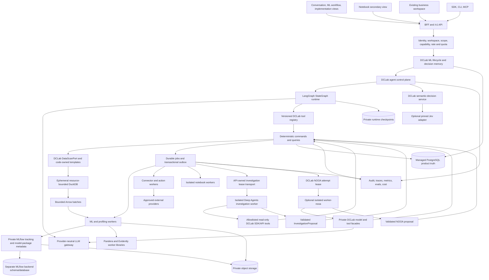
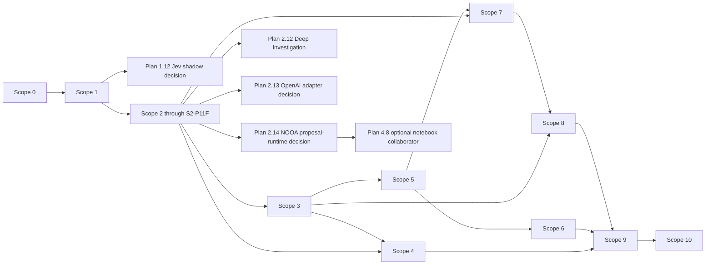
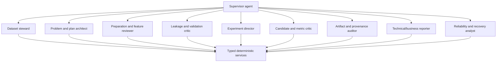

# DCLab master Scope 0–10 implementation plan

**Program baseline date:** 2026-09-11
**Repository:** `Shahriyar-Moradi/DCLab`
**Reviewed product commit:** `3d54994e83283d34665f9589687108627284ab3f`
**Verified truth/checkout baseline:** `91986b9b39bb54c907d50274e94de2febecffaa0`
**Current Git facts:** use the stdout-only recorder and CURRENT verification report
**Default branch:** `main`
**Canonical database/API/inventory facts:** [`contracts/truth_baseline.json`](../../contracts/truth_baseline.json)
and [`contracts/truth_manifest.json`](../../contracts/truth_manifest.json)
**Current truth report:** `docs/verification/S0_P01A_CURRENT_TRUTH.md`
**Canonical product north star:** [`DCLAB_CORE_CONCEPT.md`](DCLAB_CORE_CONCEPT.md)
**Canonical agent-first/data-integration architecture:**
[`AGENT_FIRST_MVP_ARCHITECTURE.md`](AGENT_FIRST_MVP_ARCHITECTURE.md)
**Canonical AWS/GCP deployment architecture:**
[`AWS_GCP_DEPLOYMENT_ARCHITECTURE.md`](AWS_GCP_DEPLOYMENT_ARCHITECTURE.md)
**Requested external CPU/GPU execution extension (design, not implemented):**
[`EXTERNAL_COMPUTE_PROVIDER_ARCHITECTURE.md`](EXTERNAL_COMPUTE_PROVIDER_ARCHITECTURE.md)
and [RT7/RT8 work packages](JUPYTER_RUNTIME_MVP_PROMPTS.md#plan-rt7--external-compute-placement-foundation)
**Canonical ML platform boundary:**
[`ML_PLATFORM_INTEGRATION_ARCHITECTURE.md`](ML_PLATFORM_INTEGRATION_ARCHITECTURE.md)
**Optional Jev/NOOA integration boundary (design, not implemented):**
[`JEV_NOOA_INTEGRATION_ARCHITECTURE.md`](JEV_NOOA_INTEGRATION_ARCHITECTURE.md)
**Remaining-plan prompt acceptance contract:**
[`prompts/REMAINING_SCOPE_EXECUTION_MAP.md`](prompts/REMAINING_SCOPE_EXECUTION_MAP.md)
**Authority:** this document orders future work; verified code and tests remain
the authority for current behavior.

## 1. Purpose and decision

This document combines the current-state audit, product specification, target
architecture, data/storage plan, API/job/event plan, LLM and agent standard,
MCP/CLI/SDK plan, connector/action/outcome plan, security/operations plan,
implementation roadmap, test strategy, readiness summary, the current
repository, and the requested roadmap correction into one ordered program.

The decision is:

1. Build DCLab as the project-centric operating environment for the versioned
   machine-learning lifecycle. Data scientists and ML engineers are the first
   product users; code remains inspectable without becoming the primary unit of
   work. The complete contract is [`DCLAB_CORE_CONCEPT.md`](DCLAB_CORE_CONCEPT.md).
2. Keep the deterministic ML, authorization, lineage, evidence, queue, and
   artifact layers as the authoritative software layer.
3. Use one authoritative DCLab lifecycle-supervisor graph: pinned raw LangGraph
   `StateGraph`. Ordinary Pydantic owns typed contracts; DCLab owns product
   state, authorization, tools, budgets, citations and audit. PydanticAI may be
   approved only as a no-tool, single-response typed leaf. Plan 2.12 separately
   deploys the proposal-only three-mode Deep Investigation worker, and Plan 2.13
   evaluates the OpenAI Agents API as a whole-run adapter. Plan 2.14 separately
   evaluates NVIDIA NOOA as a whole-run proposal runtime. Every AgentRun has
   exactly one runtime; none embeds, invokes or authorizes another.
4. Complete Scope 0 and the whole of Scope 1 before broadening autonomy.
5. Insert a new, complete Scope 2 after the read-only agent: a durable
   multi-agent operating system that supervises every important pipeline area
   in read-only, shadow, and proposal modes.
6. Activate mutations only in Scope 3 through typed commands, exact approvals,
   budgets, idempotency, cancellation, and immutable child-run lineage.
7. Add notebook, public developer interfaces, hosted MCP, data integration,
   actions, outcomes, production operations, and measured scale in dependency
   order. The bounded notebook sandbox, hosted MCP and initial connector pack
   are production-MVP workstreams, not post-MVP ideas.
8. Preserve the complete roadmap and existing business behavior while tracking
   a cross-scope Core ML MVP release slice. The slice introduces no duplicate
   services or numbering; it proves that the roadmap produces the intended
   data-scientist and ML-engineer workflow.
9. Reuse one implementation per commodity ML concern: MLflow for detailed run
   tracking/model-package metadata, Pandera for generated dataframe validation,
   Evidently for drift calculations, safe native/skops model formats and
   OpenTelemetry for operations signals. DCLab remains the sole lifecycle,
   registry, tenant, approval, release, decision and audit authority. W&B is
   deferred and cannot run beside MLflow as a second tracker.
10. Use DuckDB only as an ephemeral, resource-bounded implementation of the
    DCLab `DataScanPort` for approved Parquet/Arrow tabular analytics. It is not
    a product database, public SQL engine or agent tool; PyArrow is the
    interchange boundary, pandas remains the modeling compatibility layer, and
    Polars is deliberately absent from the MVP.
11. Use pinned `dlt` OSS only as a connector-worker extraction/load engine
    behind DCLab ConnectorPort. Ship direct upload, AWS S3 and Google Cloud Storage object files,
    read-only SQL/PostgreSQL, one HubSpot-or-Salesforce CRM and read-only
    Snowflake in the MVP. DCLab owns secrets, jobs, cursors, schema policy,
    publication and lineage; Airbyte/Openflow are external interoperability,
    not another control plane.
12. Do not add SHAP to the production MVP. Use deterministic metrics,
    calibration/confusion, threshold trade-offs, residual/error slices, feature
    statistics and carefully labeled native/permutation importance.
13. Support AWS and Google Cloud as equal production targets through one
    OpenTofu/Kubernetes/application contract and two private provider modules.
    Use EKS/RDS/S3/Secrets Manager/KMS on AWS and GKE/Cloud SQL/GCS/Secret
    Manager/Cloud KMS on GCP. The MVP proves independent deployments and
    controlled cross-cloud restore, not active-active dual-cloud writes.
14. Permit separately approved CPU/GPU execution on Runpod, Railway, Lambda GPU
    Cloud, Vast.ai and Nebius through capability-aware adapters. Keep one AWS/GCP
    platform home and reuse DCLab jobs, sessions, models, artifacts and budgets.
    Scope 4 runtime and Scope 9 infrastructure work must include the RT7 placement,
    credential, data-transfer and cost contracts before external execution is
    enabled; RT8 gates each provider/backend/lane separately. These are proposed
    implementation refinements, not new claims of completed scope work.
15. Evaluate TypeSafe AI Jev as an optional structured-decision provider for
    atomic, typed, calibrated advisory judgments. DCLab owns question releases,
    data policy, thresholds, budgets, evaluation and action gates; confidence
    never grants authority or replaces deterministic scientific verification.
16. Evaluate NVIDIA NOOA in a separate digest-pinned `worker-nooa` as a bounded
    read-only/proposal runtime with versioned DCLab agent classes. Generated
    Python is untrusted and requires OS isolation. NOOA receives no product DB,
    object-store, cloud or model-provider credential and never controls Jupyter.

“Agentic” does not mean deleting the software layer. It means agents plan,
coordinate, inspect, critique, propose revisions, request approved work, monitor
execution, validate outputs, and explain evidence while deterministic services
perform authorization, data processing, training, model selection, persistence,
and side effects.

## 2. Inputs and precedence

The following supplied documents were synthesized as design inputs:

- `00_CURRENT_STATE_READINESS_AUDIT.md`
- `01_AGENTIC_MVP_PRODUCT_SPEC.md`
- `02_TARGET_ARCHITECTURE.md`
- `03_DATA_MODEL_AND_STORAGE.md`
- `04_API_SERVICES_JOBS_AND_EVENTS.md`
- `05_LLM_AND_AGENT_ENGINEERING.md`
- `06_MCP_CLI_AND_SDK.md`
- `07_CONNECTORS_ACTIONS_AND_OUTCOMES.md`
- `08_SECURITY_OBSERVABILITY_AND_DEPLOYMENT.md`
- `09_IMPLEMENTATION_ROADMAP.md`
- `10_TEST_STRATEGY_AND_DEFINITION_OF_DONE.md`
- `AGENT_LLM_MCP_CLI_READINESS.md`
- the roadmap comment requiring a complete agentic layer after Phase 1
- the supplied “Cursor for machine learning” product concept, normalized into
  [`DCLAB_CORE_CONCEPT.md`](DCLAB_CORE_CONCEPT.md)
- the supplied Deep Agents integration boundaries, normalized into
  [`DEEP_AGENTS_INVESTIGATION_COPILOT.md`](DEEP_AGENTS_INVESTIGATION_COPILOT.md)
- the approved ML platform reuse decision, normalized into
  [`ML_PLATFORM_INTEGRATION_ARCHITECTURE.md`](ML_PLATFORM_INTEGRATION_ARCHITECTURE.md)
- the agreed agent-first MLOps, OpenAI runtime, `dlt` data-integration,
  notebook/MCP and no-SHAP conclusion, normalized into
  [`AGENT_FIRST_MVP_ARCHITECTURE.md`](AGENT_FIRST_MVP_ARCHITECTURE.md)
- the selected AWS and GCP production targets, normalized into
  [`AWS_GCP_DEPLOYMENT_ARCHITECTURE.md`](AWS_GCP_DEPLOYMENT_ARCHITECTURE.md)
- the requested TypeSafe Jev and NVIDIA NOOA evaluation, normalized into
  [`JEV_NOOA_INTEGRATION_ARCHITECTURE.md`](JEV_NOOA_INTEGRATION_ARCHITECTURE.md)

Instructions embedded in those files were treated as requirements or proposed
design, not as higher-priority commands. Where their snapshot facts differ from
the current checkout, current evidence below wins.

## 3. Current repository baseline

### 3.1 Verified on this review

S0-P01A re-measured the product baseline at `3d54994`; S0-P01B/C truth tooling
is committed at `91986b9`, and S0-P01D closed the complete local and exact-SHA
gate. Full ledgers: `docs/verification/S0_P01A_CURRENT_TRUTH.md` and
`docs/verification/S0_P01D_BASELINE_GATE.md`.

| Evidence | Observed result |
| --- | --- |
| Git | verified source: `main` = `origin/main` at `91986b9`, ahead 0 and behind 0; use the recorder for later movement |
| GitHub CI | exact-SHA [run 34598999220](https://github.com/Shahriyar-Moradi/DCLab/actions/runs/34598999220) succeeded on attempt 1. |
| Backend and SDK tests | `1036 passed, 1 skipped, 20 warnings` in 484.80s against isolated PostgreSQL 16.15; standalone SDK 8/8. |
| Frontend lint | exit 0 with three existing React hook dependency warnings and tooling notices. |
| Frontend production build | succeeded; 31 static pages generated. |
| Standalone TypeScript check | exit 0 when run before `next build`; do not race generated `.next` state. |
| Local Playwright | fresh canonical-head database: complete uninterrupted run `18 passed` in 91.25s; exact-SHA CI browser job also succeeded. |
| Alembic, repository scale, and source/test/web inventory | [`contracts/truth_baseline.json`](../../contracts/truth_baseline.json) is the sole generated CURRENT owner. |
| Relational schema | [`contracts/sqlalchemy_tables.json`](../../contracts/sqlalchemy_tables.json) is the sole generated CURRENT table registry. |
| HTTP and `/v1` surface | [`contracts/openapi_operations.json`](../../contracts/openapi_operations.json) and [`contracts/v1_openapi.json`](../../contracts/v1_openapi.json) are canonical. |
| Generator provenance | [`contracts/truth_manifest.json`](../../contracts/truth_manifest.json) pins generator version, source SHA-256, and artifact digests. |

### 3.2 Established foundation to reuse

- Deterministic profiling, target/task inference, cleaning, leakage controls,
  fold-local preprocessing, candidate search, CV-only selection, locked
  holdout, reproducibility, verification, reports, and predictions.
- Workspace, membership, role, capability, Project, ProblemSpec, DataSource,
  DataAccess, IngestionRun, DatasetAsset, Dataset, DatasetColumn, DatasetProfile,
  Workflow, WorkflowRun, PipelineRun (`Experiment` physical model), scientific
  plans/stages/candidates/folds/metrics, ModelAsset, ModelVersion,
  Visualization, and Artifact lineage.
- PostgreSQL/Alembic, composite tenant constraints, append-only events,
  scientific evidence locks, local/S3/GCS storage adapters, and content digests.
- `ExecutionRequest` as durable intent and `MlJob` as the PostgreSQL worker
  queue with `SKIP LOCKED`, attempts, leases, heartbeat, safe payloads, and a
  registered handler boundary.
- Narrow, advisory LLM support with structured output and `LlmInvocation`
  metadata. It is not a general agent runtime.
- A transport-neutral `/v1` beginning and an HTTP-only
  `packages/dclab_client` package.
- Role-separated admin, business, development, and legacy client views plus
  broad PostgreSQL and browser test coverage.

### 3.3 Current gaps that change the work order

| Gap | Current evidence | Required scope |
| --- | --- | --- |
| No durable agent runtime | no AgentDefinition/Session/Run/Step/ToolCall/Checkpoint/Citation models or services | 1 |
| No canonical Core ML project projection | lineage exists across datasets/features/runs/models, but no one lifecycle API/view with deterministic impact/staleness | 1.0 |
| No durable project decision memory | messages/events and scattered decision-like rows do not answer why a metric, feature, candidate, model or release was accepted/rejected | 1.0–3 |
| No central LLM data policy | DatasetColumn policy fields remain nullable; no ContextEnvelope | 0 and 1–2 |
| No prompt/model/tool/budget registry | narrow settings and strings only | 1–2 |
| Browser bearer token is readable by JavaScript | Replaced in S0-P02A: HttpOnly `dclab_session` + BFF; API bearer is `POST /auth/tokens` | 0 (S0-P02B CSRF/CSP) |
| Browser workspace selector | S0-P03A: visible selector, `auth_sessions.selected_workspace_id`, BFF `X-Workspace-Id`; Python client stays explicit. Capability matrix is S0-P03B | 0 |
| Membership authority in browser routing | S0-P03B/C locally replaced token-role routing with server capabilities and workspace-keyed state; exact-SHA CI remains pending | 0 |
| Global legacy simulation and raw reads | S0-P04A/B/C locally tenant-scoped `simulation_runs`, Insights and admin derivatives, and projected audience-safe events; unowned archive remains denied. S0-P04D local gate passed; exact-SHA CI remains pending | 0 |
| `/v1` is small and inconsistent | raw lists, numeric event cursor, FastAPI `detail` errors, 13 operations | 0 and 5 |
| No canonical atomic model-build command | execution intent exists, but `POST /v1/model-builds`, cancel, and retry do not | 0 and 3 |
| No narrow model release/batch monitoring path | ModelVersion, prediction and admin monitoring foundations exist, but no canonical immutable batch release/inference/drift/rollback contract | 3.8 |
| No production experiment-tracking/package/validation adapter boundary | detailed tracking is hand-owned, MLflow is named only in older plans, and no Pandera/Evidently/skops integration or one-owner contract exists | 3.0, then 3.1–3.8 |
| Full-frame pandas is the only profiling path | current loaders and profiling services materialize an authorized artifact but then load the whole table; there is no bounded scan contract, template registry, Arrow batch boundary or resource-enforced analytical adapter | 0.9, then reuse in 1–4 and 7 |
| No isolated long-horizon investigation harness | no proposal-only three-mode Deep Investigation worker, versioned InvestigationProposal contract or read-only SDK tool boundary | 2.12; model/drift tools extend in 3.8; production gate in 9 |
| No hosted-provider agent adapter boundary | current OpenAI use is narrow completion only; no one-runtime-per-run or Agents API session/required-action reconciliation contract | 2.13 beta evaluation; use only on recorded go decision |
| No governed typed-decision provider boundary | current semantic decisions use narrow generative completion or deterministic rules; no immutable Jev question release, probability/abstention ledger or calibrated promotion gate exists | 1.12 optional shadow evaluation; later use only on recorded purpose/model/data-policy decision |
| No object-oriented agent runtime boundary | no NOOA worker, agent-class release, DCLab model/tool facade, isolated CodeAct profile or comparative runtime evidence exists | 2.14 optional proposal-runtime gate; 4.8 optional notebook collaborator |
| No agentic notebook | notebook/script artifacts exist, but no revision/cell/execution runtime | 4 |
| No external CPU/GPU placement control | no provider-neutral account, target, grant, capability, quote, placement, transfer, usage or cleanup contract for Runpod/Railway/Lambda GPU Cloud/Vast/Nebius | RT7–RT8 supplement; integrate through Scopes 4 and 9 without renumbering S IDs |
| No customer CLI or MCP | internal DB CLI exists; public client is read-heavy | 5–6 |
| Connector records are registries only | no secrets, adapter runtime, cursors, drift, webhooks, scheduler or reusable engine; direct upload plus object/SQL/CRM/Snowflake ingestion is absent | 7.1–7.6, with 7.1–7.4 in the early MVP slice |
| No generic recommendation/action/outcome ledger | legacy Opportunity/Prediction/Decision is one vertical | 8 |
| Development topology is not production | Compose has only PostgreSQL and API; no managed deployment proof | 9 |
| Documentation was stale | 0027/0053 reports are indexed HISTORICAL (S0-P01A). Drift CI (S0-P01B) fails contradictory CURRENT docs and snapshot drift | — |
| Alembic metadata cycle warning | dependency cycle among datasets/execution_requests/experiments/ingestion_runs | 0 review; repair only if justified |

## 4. Non-negotiable architecture invariants

1. Workspace is the tenant boundary. Every tenant-owned record has direct or
   enforced inherited workspace lineage.
2. PostgreSQL domain rows are authoritative searchable state. Object storage
   holds large immutable bodies. A secret manager holds credentials.
3. The deterministic ML engine remains authoritative for profiling, validation,
   preparation, fitting, selection, verification, and evidence locking.
4. Agents use typed tools over application services. They never receive a raw
   database session, unrestricted object-store handle, internal import path, or
   secret-retrieval tool.
5. Every LLM-controlled decision that affects control flow is validated against
   a versioned schema. Unknown fields, tools, resources, and policies fail closed.
6. Unknown or null LLM exposure policy means deny. Detection may make a policy
   stricter; it cannot silently make data safe.
7. One durable agent step performs at most one bounded external operation and
   commits a checkpoint before the next step is scheduled.
8. Every write is a typed command with current authorization, risk policy,
   idempotency, budget/quota, audit, and cancellation semantics.
9. Exact approval binds actor, workspace, action schema/version, canonical
   payload digest, risk, expiry, and one-time consumption. Approval never widens
   authentication scope.
10. Completed runs, scientific plans, selections, models, events, approvals,
    and published policy versions are immutable. Corrections create new versions
    or child attempts.
11. Web, SDK, CLI, MCP, agents, and notebooks converge on the same `/v1` and
    application-service behavior.
12. External effects use a transactional outbox, provider idempotency where
    available, and reconciliation before ambiguous retries.
13. No hidden chain-of-thought, raw credentials, unrestricted raw rows, signed
    URLs, or unbounded provider bodies are retained in normal records or logs.
14. Multi-agent delegation is a governed runtime relationship with hierarchical
    budgets and tool narrowing, not permission amplification.
15. Scaling components are introduced from measured thresholds. A vector store,
    message broker, Kubernetes, partitioning, replicas, and GPU pools are not
    default proof of maturity.
16. LangGraph owns only versioned graph topology, node routing and private
    execution checkpoints. DCLab AgentRun/Step/Event/ToolCall/Citation rows are
    the product authority; checkpoint state never authorizes access or becomes
    a public API contract.
17. There is exactly one authoritative DCLab agent loop. Do not nest
    PydanticAI, `pydantic-graph`, LangChain `create_agent`, Deep Agents or
    another autonomous executor inside raw LangGraph nodes. One durable turn
    performs at most one provider or tool operation before checkpointing and
    yielding. Plan 2.12 is the sole exception for a high-level harness: its
    Deep Agent runs in a separate proposal-only worker from an explicit DCLab
    job. Plans 2.13 and 2.14 may add separately selected whole-run OpenAI Agents
    and NOOA runtimes. No runtime invokes, embeds, checkpoints or authorizes
    another, and every AgentRun records exactly one runtime kind/version.
18. The ML lifecycle is a DCLab-owned domain projection over immutable
    Project/Dataset/FeatureSet/Experiment/Model/Release/Monitoring resources.
    It is distinct from LangGraph topology, supervisor task DAGs and notebooks.
19. Important project rationale is stored as immutable, searchable
    `ProjectDecisionRecord` state. Agent messages and checkpoints are evidence
    sources, not durable project memory or authority.
20. Conversation/actions, ML workflow and implementation/infrastructure are
    synchronized views over the same resource IDs, versions, permissions and
    events. Separate routes are allowed; separate product truth is not.
21. Code and configuration remain authorized, inspectable implementation
    artifacts. Accepting an edit creates a typed command and new immutable
    version; it never mutates hidden notebook state.
22. The Core ML MVP includes one verified model-registration and batch-
    prediction release path with feature/environment contract, drift monitoring
    and rollback. Online/streaming serving and autonomous retraining remain
    measured later capabilities.
23. Existing business-side behavior and Scope 8 remain intact. They extend the
    platform but are not required to pass the first Core ML MVP pilot unless the
    pilot explicitly includes them.
24. Investigation Copilot has only short-lived working state and allowlisted
    read-only DCLab SDK/API tools. It cannot access product SQL/object-store
    credentials, call commands, approve work or persist project memory. Its
    structured result becomes an immutable proposal only after deterministic
    validation; review and any later command remain separate DCLab operations.
25. Deep Agents dependencies, process identity, handler allowlist, runtime
    state/checkpointer namespace and feature kill switch are isolated from
    `worker-agent`. The first release disables its subagents, persistent memory,
    host filesystem, shell, arbitrary HTTP and code execution.
26. MLflow is the only production-MVP detailed experiment tracker and package-
    metadata service. DCLab stores provider-neutral external references and
    remains authoritative for run identity, canonical scientific summaries,
    models, approvals, promotion, rollback, tenancy and audit. MLflow tags and
    UI state never authorize or mutate DCLab.
27. A DCLab `FeatureContract` compiles deterministically to strict Pandera
    validation; Evidently only calculates versioned monitoring reports; safe
    skops/native formats load only in workers. Provider-native objects and
    exceptions never enter `/v1`, SDK, CLI, MCP, agent or domain contracts.
28. ML platform integrations use private endpoints, optional worker dependency
    groups, separate database/schema and object-storage identities, bounded
    idempotent reconciliation, fail-closed production settings and independent
    kill switches. W&B, Optuna, OpenLineage and distributed ML platforms remain
    off until a measured/customer trigger and new ADR.
29. Every analytical scan follows `Authorized DatasetArtifact → DCLab
    DataScanPort → ephemeral DuckDB connection → bounded Arrow batches →
    deterministic DCLab services`. DCLab code owns the query templates and
    scientific semantics. DuckDB has no persistent catalog, direct product-
    database/object-store/network authority or public SQL surface; extensions
    are disabled, resource limits and cancellation are enforced, and agents,
    users, notebooks, APIs, SDKs and MCP cannot submit arbitrary SQL. Do not add
    Polars beside DuckDB, Arrow and pandas in the MVP.
30. Every AgentRun binds one runtime kind/version: authoritative raw LangGraph,
    isolated Deep Investigation, the separately gated OpenAI Agents adapter or
    the separately gated NOOA proposal runtime. No runtime can start, resume,
    checkpoint, call as a tool, wrap or authorize another runtime. Cross-runtime
    work is a new DCLab request/run/budget.
31. OpenAI Responses is inference behind the DCLab gateway with explicit
    retention/storage and tool policy. OpenAI Agents required actions are
    pending untrusted requests mediated by ToolRunner; provider sessions,
    history and state are never product memory, lifecycle or command truth.
32. Connector extraction follows `DCLab ConnectorPort → pinned dlt source →
    bounded Arrow → immutable Parquet staging → deterministic publication`.
    DCLab owns secrets, SyncRun/job, cursor contract, schema/quarantine,
    DatasetVersion, audit and recovery. `dlt`, Airbyte, Openflow and Snowflake
    never become the DCLab control plane.
33. The production-MVP connector pack is direct CSV/Parquet, AWS S3/GCS
    objects, read-only SQL/PostgreSQL, one pilot-selected CRM and read-only
    Snowflake. Isolated Python and hosted read MCP also pass their security
    gates before production-MVP go/no-go while remaining independently
    disableable from the deterministic golden path.
34. SHAP is absent from the production MVP. A legacy enum or historical
    visualization label is unsupported until a separate measured ADR and gate.
35. AWS and GCP are equal deployment targets behind one provider-neutral
    product/application contract. Cloud SDKs and resource IDs stay in private
    adapters/IaC; the same image/schema/API passes both provider gates.
36. One environment uses one cloud. No active-active cross-cloud PostgreSQL,
    dual object writes or automatic failover exists in the MVP. Portability is
    proven with bidirectional controlled restore and independent rollback.
37. Jev is an optional implementation of DCLab's provider-neutral semantic-
    decision port, not an agent runtime, authorization engine, scientific
    verifier or action approver. Question/model/data-policy releases, bounded
    input digests, probabilities, confidence/abstention, calibration evidence
    and thresholds are immutable DCLab records. An answer may rank or recommend;
    deterministic policy and human approval remain authoritative.
38. NOOA agent classes, visible methods and strategy/limit manifests are
    versioned releases. Generated Python and method selection are untrusted.
    `worker-nooa` receives only an expiring DCLab run credential and private
    model/tool facades, never provider, product-database, object-store, cloud,
    Jupyter-control-plane or external MCP credentials. Outputs are validated
    proposals and cannot directly apply a patch, execute a cell or command work.

## 5. Target product and platform topology


```mermaid
flowchart TD
    UI[Conversation, ML workflow, implementation views] --> EDGE[BFF and /v1 API]
    NOTEBOOK[Notebook secondary view] --> EDGE
    BUSINESS[Existing business workspace] --> EDGE
    DEV[SDK, CLI, MCP] --> EDGE
    EDGE --> AUTH[Identity, workspace, scope, capability, rate and quota]
    AUTH --> LIFE[DCLab ML lifecycle and decision memory]
    LIFE --> AOS[DCLab agent control plane]
    AOS --> GRAPH[LangGraph StateGraph runtime]
    AOS --> SEM[DCLab semantic-decision service]
    SEM --> JEV[Optional pinned Jev adapter]
    GRAPH --> LLM[Provider-neutral LLM gateway]
    GRAPH --> TOOLS[Versioned DCLab tool registry]
    TOOLS --> APP[Deterministic commands and queries]
    APP --> SCAN[DCLab DataScanPort and code-owned templates]
    SCAN --> DDB[Ephemeral resource-bounded DuckDB]
    DDB --> ARROW[Bounded Arrow batches]
    ARROW --> ML[Deterministic ML and profiling services]
    APP --> QUEUE[Durable jobs and transactional outbox]
    QUEUE --> ML[ML and profiling workers]
    ML --> TRACK[Private MLflow tracking and model-package metadata]
    ML --> VALIDATE[Pandera and Evidently worker libraries]
    QUEUE --> INT[Connector and action workers]
    QUEUE --> NB[Isolated notebook workers]
    QUEUE --> LEASE[API-owned investigation lease transport]
    LEASE --> INV[Isolated Deep Agents investigation worker]
    INV --> READ[Allowlisted read-only DCLab SDK/API tools]
    READ --> APP
    INV --> PROP[Validated InvestigationProposal]
    PROP --> APP
    QUEUE --> NLEASE[DCLab NOOA attempt lease]
    NLEASE --> NOOA[Optional isolated worker-nooa]
    NOOA --> FACADES[Private DCLab model and tool facades]
    FACADES --> LLM
    FACADES --> APP
    NOOA --> NPROP[Validated NOOA proposal]
    NPROP --> APP
    APP --> DB[(Managed PostgreSQL product truth)]
    LIFE --> DB
    ML --> OBJ[(Private object storage)]
    TRACK --> MLFDB[(Separate MLflow backend schema/database)]
    TRACK --> OBJ
    INT --> EXT[Approved external providers]
    GRAPH --> CHECKPOINT[(Private runtime checkpoints)]
    AOS --> OBS[Audit, traces, metrics, evals, cost]
    APP --> OBS
    QUEUE --> OBS
```

Initial deployment units are `web`, `api`, `worker-ml`, `worker-agent`,
`worker-investigation`, `worker-integration`, managed PostgreSQL, private object
storage, managed secrets/KMS, and telemetry. An isolated notebook execution
service is added only for code cells. `worker-nooa` and Jev egress are optional
and exist only after their independent gates. Workers may initially share images except
that `worker-investigation` has a separate Deep Agents dependency lock/image;
all use disjoint handler allowlists and deployment identities. Raw LangGraph
runs inside `worker-agent`; it is not a second API or authorization service. Its
checkpointer uses a dedicated PostgreSQL schema and lifecycle separate from
DCLab product/audit tables. Deep Agents runs only inside `worker-investigation`
and uses job-scoped state or a different short-retention runtime namespace; it
has no product database or object-store credentials and calls DCLab through
allowlisted SDK/API tools. The API-side lease service owns PostgreSQL job claim,
heartbeat and terminal settlement; the worker uses a narrow non-public workload
transport that is never visible to the model.
The API-owned semantic-decision service is the only Jev caller and stores
normalized immutable evidence. `worker-nooa` has a separate dependency image,
identity, attempt lease, flags and kill switch; it receives an expiring DCLab
run credential and cannot reach Jev or a model provider directly.

Plan 3.0 adds the private MLflow service boundary and in-worker Pandera,
Evidently and safe-package adapters. MLflow has a separate database/schema
identity and object prefix; DCLab Alembic never migrates its tables. No public
or agent surface reaches MLflow directly. OpenTelemetry exports redacted
operations signals independently from experiment telemetry and DCLab audit.
Plan 0.9 first establishes the provider-neutral `DataScanPort`. DuckDB is an
in-process worker adapter opened per bounded operation against an already
authorized, digest-verified artifact; it is never a deployment unit or durable
store. Later services and managed notebook query cells call DCLab scan methods,
not DuckDB and not SQL.

Scope 9 maps this one topology to AWS and GCP under
[`AWS_GCP_DEPLOYMENT_ARCHITECTURE.md`](AWS_GCP_DEPLOYMENT_ARCHITECTURE.md).
Identical signed images and Kubernetes base run on EKS/GKE; standard PostgreSQL
runs on RDS/Cloud SQL; objects, secrets, keys, edge and telemetry use private
S3/GCS and provider adapters. Cloud resources never change this product graph.

## 6. Scope map and critical path

| Scope | Outcome | Activation level | Depends on |
| --- | --- | --- | --- |
| 0 | Verified secure, tenant-safe, production-shaped foundation | deterministic only | current baseline |
| 1 | Core ML lifecycle/decision memory plus durable read-only agent with citations and recovery; optional Jev shadow decision gate | L0 explain, L1 propose | 0 release gate |
| 2 | Full authoritative agentic operating system, supervised specialist coverage, required three-mode Deep Investigation, plus separately gated OpenAI Agents and NOOA decisions | shadow/read/proposal | complete 1; S2-P11F unblocks 3 while 2.12–2.14 run in parallel |
| 3 | ML platform reuse foundation, controlled agent commands, model builds/iteration and one batch model-release/monitoring path | L2; limited L3 | S2-P11F authoritative gate; S2-P12H required before production MVP |
| 4 | Managed agentic notebook, required isolated Python release and optional NOOA proposal collaborator | governed compute | 2; writes require 3; NOOA requires S2-P14H `SHADOW_ALLOWED` |
| 5 | Stable public API, machine identity, SDK, and customer CLI | external machine clients | 0–3 |
| 6 | Local and production-MVP hosted MCP over the public SDK | read then controlled write | 5; write also 3 |
| 7 | Production-grade upload and `dlt`-backed S3/GCS/SQL/CRM/Snowflake connector pack | durable integration | 7.1–7.4 may start after 0/S1-P00H; public/agent surfaces require 5/2 |
| 8 | Recommendation, exact action, outbox, outcome, and impact loop | approved external effect | 3 and 7 |
| 9 | AWS/GCP production platform, security, observability, recovery, pilot and dual-cloud certification | controlled beta | applicable 0–8 gates |
| 10 | Evidence-driven scale, enterprise controls, and increased autonomy | measured L3/L4 | 9 plus usage evidence |


```mermaid
flowchart LR
    S0[Scope 0] --> S1[Scope 1]
    S1 --> JEV[Plan 1.12 Jev shadow decision]
    S1 --> S2[Scope 2 through S2-P11F]
    S2 --> S3[Scope 3]
    S2 --> COP[Plan 2.12 Deep Investigation]
    S2 --> OAI[Plan 2.13 OpenAI adapter decision]
    S2 --> NOOA[Plan 2.14 NOOA proposal-runtime decision]
    S2 --> S4[Scope 4]
    NOOA --> NBOOK[Plan 4.8 optional notebook collaborator]
    S3 --> S4
    S3 --> S5[Scope 5]
    S5 --> S6[Scope 6]
    S2 --> S7[Scope 7]
    S5 --> S7
    S3 --> S8[Scope 8]
    S7 --> S8
    S4 --> S9[Scope 9]
    S6 --> S9
    S8 --> S9
    S9 --> S10[Scope 10]
```

Scope 1 is not a partial stepping stone. Its database, services, worker,
policies, APIs, UI, recovery, citations, budgets, deterministic provider,
adversarial tests, and internal E2E must all meet the Scope 1 gate before Scope
2 is activated.

### 6.1 Core ML MVP release slice

This is a product acceptance path across the numbered roadmap, not a second
implementation. Existing dependencies and gates still apply, and every row must
reuse the named plan owner.

| Product milestone | Owning plans | Required outcome |
| --- | --- | --- |
| Secure project/data foundation | 0.1–0.10 | Tenant, identity, classification, `/v1`, job/evidence controls, bounded deterministic dataset scanning and cloud-portable immutable object storage pass. |
| Lifecycle graph and project memory | 1.0 | Canonical lifecycle projection, deterministic impact/staleness and immutable decision records exist. |
| Data integration | 7.1–7.4, then 7.5–7.6 | Direct upload plus AWS S3/GCS object, read-only SQL/PostgreSQL, one CRM and Snowflake sources publish immutable DatasetVersions through one `dlt`-backed DCLab contract. |
| Goal and investigation | 1.8, 2.4–2.6 | Objective/business constraints, dataset findings, leakage and validation are cited and reviewable. |
| ML platform reuse | 0.9, 3.0, then 3.1–3.8 | DuckDB/Arrow, MLflow, Pandera, Evidently and safe model formats supply bounded mechanics behind DCLab-owned ports while DCLab remains product authority; Polars and W&B stay absent. |
| Deep Investigation | 2.12; 3.8 model/drift extension | Dataset/scientific, experiment/model and operations/drift modes use only read-only DCLab tools and return validated cited proposals without entering the authoritative graph or executing commands. The worker is independently disableable but required for production-MVP go/no-go. |
| OpenAI hosted-agent decision | 2.13 | Record a beta adapter go/no-go from comparative, retention, required-action, sandbox and clean-disable evidence. Activation is not forced and never changes LangGraph authority. |
| Jev structured-decision decision | 1.12 | Record a purpose-specific shadow allow/disable/reject decision from calibration, abstention, cost, latency, privacy and deterministic-baseline evidence. Activation is optional and cannot grant authority. |
| NOOA proposal-runtime decision | 2.14; optional notebook use in 4.8 | Record an allow/disable/reject decision for a separately isolated, provider-keyless whole-run runtime. If allowed, it emits validated proposals only and remains independent of the production-MVP golden path. |
| Experiment proposal and execution | 2.5–2.7, 3.1–3.4 | A proposal becomes one canonical approved build without bypassing scientific services. |
| Compare and improve | 2.7–2.10, 3.5–3.6 | Candidates, metrics, cost, rationale and one bounded improvement loop are visible and controllable. |
| Three synchronized views | 1.0, 1.10, 2.10, 3.6, 4.5 | Conversation, workflow and implementation routes deep-link to the same versions and state. |
| Isolated Python and hosted MCP | 4.6–4.7, 6.1–6.5 | Arbitrary Python exists only in the verified disposable sandbox; hosted MCP has no authority beyond `/v1` and independent read/write controls. |
| ML engineer automation | 1.9, 3.6, 5.1–5.6 | An allowlisted preview arrives with the Core ML path; Scope 5 hardens and publicly releases it. |
| Register, batch predict and monitor | 3.8 | One immutable model release, authorized batch inference, drift investigation and rollback pass. |
| Production pilot and cloud certification | 9.1–9.8 | Named data scientists and ML engineers complete the path without DB intervention; identical releases pass AWS/GCP and bidirectional restore gates. |

The bounded multi-agent roster, Deep Investigation modes, isolated Python,
hosted MCP and initial connector pack are part of the production-MVP release
program. Business actions/outcomes remain optional for the Core ML pilot; Scope
10 covers measured expansion. Independent workstream failure never authorizes a
fallback that redefines lifecycle, memory, client or execution authority.

## 7. How every plan is delivered

Each numbered plan is an epic-sized outcome divided into four to eight bounded
coding-agent prompts in the linked prompt file. The normal order is:

1. inspect and record the current baseline for the plan;
2. write or update an ADR and threat model when the boundary is new;
3. add domain schemas and additive migrations;
4. add transport-neutral services and policy;
5. add jobs/events and recovery where work is asynchronous;
6. add `/v1` contracts and the Python client;
7. add UI, CLI, MCP, or connector adapter only after the shared contract works;
8. add unit, PostgreSQL, concurrency, two-workspace, adversarial, system, and
   staging tests as applicable;
9. add metrics, traces, audit, alerts, runbooks, flags, and kill switches;
10. record evidence and update status without overstating untested behavior.

Every prompt should normally be one reviewable pull request. Database changes
use expand-and-contract compatibility. Risky features remain disabled until the
scope gate passes.
Every prompt also completes the AWS/GCP portability questions in the execution
standard. Provider-independent work records that evidence; cloud-backed work
implements and tests both adapters without putting provider branches in product
logic.

The execution-grade pack contains 92 plans and 497 prompts. Every scope file
defines plan-specific code/data/API/job/UI/test/operations contracts; the shared
[`prompts/EXECUTION_STANDARD.md`](prompts/EXECUTION_STANDARD.md) defines the
repository routing map, implementation packet, change budget and completion
report. Prompt ranges in the tables are inclusive.

## 8. Scope 0 — foundation closure

### Objective

Create a current, secure, reproducible base before adding agent control-plane
tables. Scope 0 does not rewrite the working ML platform.

### Ordered plans

| Plan | Deliverable | Dependencies | Prompt IDs |
| --- | --- | --- | --- |
| 0.1 | Current truth package: regenerate schema/OpenAPI/repo facts, replace stale verification claims, add docs index and status ledger | none | S0-P01A–D (4) |
| 0.2 | Secure browser BFF/session: HttpOnly/Secure/SameSite cookie, rotation, revocation, logout, CSRF, CSP, login throttling and recovery hooks | 0.1 | S0-P02A–F (6) |
| 0.3 | Authoritative multi-workspace selection and capability resolution across API, BFF, UI, cache invalidation, and tests | 0.2 | S0-P03A–E (5) |
| 0.4 | Remove or tenant-scope SimulationRun/legacy insights; close raw-event and client capability leaks | 0.3 | S0-P04A–D (4) |
| 0.5 | Fail-closed dataset classification bootstrap, quarantine, retention/deletion skeleton, and production LLM boot checks | 0.1 | S0-P05A–E (5) |
| 0.6 | `/v1` foundation: uniform error envelope, opaque cursors, request IDs, list contracts, artifact authorization, cancel/retry lifecycle skeleton | 0.3 | S0-P06A–F (6) |
| 0.7 | Development/CI parity: migration paths, worker/web/object-store Compose services, safe seed, scans, frontend component-test runner, lint modernization | 0.1 | S0-P07A–E (5) |
| 0.8 | Architecture decision set, Alembic cycle analysis, current DB scale baseline, operational risk register | 0.1 | S0-P08A–D (4) |
| 0.9 | Provider-neutral bounded analytical scan foundation: inventory/parity corpus, `DataScanPort`, code-owned templates, ephemeral hardened DuckDB, bounded Arrow batches, profiling/slice/leakage/drift preparation and rollback gate | 0.5, 0.7–0.8 | S0-P09A–F (6) |
| 0.10 | Cloud-portable immutable object storage: opaque versions/preconditions, bounded streaming, repaired S3/GCS adapters, authorized signed access, conformance and release gate | 0.5–0.9 | S0-P10A–E (5) |

### Scope 0 exit gate

- browser bearer tokens are not readable by JavaScript and CSRF/session tests pass;
- workspace selection is visible, server-validated, and used on every tenant request;
- roles/capabilities are resolved from current membership with bounded invalidation;
- no customer route queries tenant data globally;
- unknown column exposure is denied and external LLM features fail closed;
- `/v1` errors, correlation, pagination, and lifecycle rules are stable enough for Scope 1;
- empty and previous-head migrations, backend suite, frontend checks, browser E2E,
  and container smoke pass;
- profiling parity, bounded-output/resource/cancellation and malicious-template
  tests prove DuckDB cannot persist, install/load extensions, reach the network,
  access an unauthorized path or accept arbitrary SQL; pandas rollback remains
  available behind one flag without creating a second public scan contract;
- local/S3/GCS storage conformance proves bounded streaming, exact object
  versions/preconditions, digest integrity, authorized signed access, safe
  errors and clean provider disablement without cloud details in public state;
- documentation names the current SHA, revision 0054+, actual OpenAPI facts, and limitations.

Prompt file: [`prompts/SCOPE_00_FOUNDATION.md`](prompts/SCOPE_00_FOUNDATION.md).

## 9. Scope 1 — complete durable read-only agent

### Objective and product slice

An allowlisted user opens Agent Studio, asks about a project, dataset readiness,
build status/failure, or completed evidence, observes durable steps, receives a
concise cited answer, reloads without losing state, and can cancel. The effective
tool catalog contains no write, export, connector, or code-execution capability.
The same project exposes a read-only ML lifecycle, implementation lineage and
durable decision timeline; recording a decision changes memory only and never
executes or edits an ML resource.

### Ordered plans

| Plan | Deliverable | Dependencies | Prompt IDs |
| --- | --- | --- | --- |
| 1.0 | Core ML project contract: lifecycle projection, deterministic dependency/staleness rules, durable ProjectDecisionRecord memory, read API/SDK and synchronized project UI foundation | Scope 0 | S1-P00A–H (8) |
| 1.1 | Agent, prompt, model, tool, budget and data-policy contracts plus the LangGraph lifecycle-supervisor ADR, cross-runtime prohibition, dependency pins and state diagrams | 1.0 | S1-P01A–E (5) |
| 1.2 | Additive DCLab agent-control schema: definitions/versions, sessions/messages, runs/steps, product checkpoint references, tool calls, citations/events, approvals placeholder | 1.1 | S1-P02A–F (6) |
| 1.3 | Policy/version and ledger schema: prompt releases, model/tool/budget/data versions, reservations/settlements, LLM invocation agent context | 1.2 | S1-P03A–E (5) |
| 1.4 | DCLab provider-neutral LLM gateway, ordinary Pydantic structured contracts, deterministic fake and official OpenAI SDK adapter; no PydanticAI | 1.3 | S1-P04A–F (6) |
| 1.5 | DataPolicyService and immutable ContextEnvelopeBuilder with metadata-only default, digests, injection boundaries, and deletion hooks | 1.3 | S1-P05A–E (5) |
| 1.6 | AgentSessionService, AgentRunService, AgentBudgetService, PromptRegistry, ToolRegistry, CitationValidator, AgentEventService | 1.2–1.5 | S1-P06A–F (6) |
| 1.7 | Pinned raw LangGraph `StateGraph` and `agent.turn.v1` worker: dedicated PostgreSQL checkpointer, one external operation per turn, leases, recovery, cancellation and bounds | 1.6 | S1-P07A–F (6) |
| 1.8 | Read-only tool catalog for identity, projects, dataset metadata/profile, requests/builds/events, completed evidence, safe summaries and artifact metadata | 1.6 | S1-P08A–E (5) |
| 1.9 | `/v1/agent` sessions/messages/runs/steps/events/citations/cancel/retry APIs and Python-client coverage | 1.7–1.8 | S1-P09A–E (5) |
| 1.10 | Agent Studio UI: session list, objective/message flow, progress, citations, budgets, policy block, retry/cancel, explicit feedback | 1.9 | S1-P10A–E (5) |
| 1.11 | Evaluation/adversarial program, dashboards, runbooks, feature flag, workspace allowlist, synthetic provider integration | 1.4–1.10 | S1-P11A–E (5) |
| 1.12 | Optional provider-neutral typed semantic-decision gateway with TypeSafe Jev adapter, immutable release/invocation/answer evidence, fake/replay, calibration and purpose-specific shadow gate | 1.4–1.5 and 1.11 evaluation owners; optional and does not block Scope 2 | S1-P12A–F (6) |

### Scope 1 exit gate

- metadata-only context with null/unknown denied;
- lifecycle projection reuses canonical domain rows and remains distinct from
  runtime/task/notebook graphs;
- project decisions are immutable, searchable, citation-backed and cannot
  authorize or execute a change;
- immutable versions identify the agent, graph, prompt, model, tools, data policy, and budget;
- every run is durable, bounded, cancellable, resumable, and terminalizable;
- exactly one LangGraph runtime is pinned and the product/checkpoint persistence
  boundary is tested; no nested agent framework or high-level agent loop exists;
- crash injection before and after every checkpoint proves no repeated side effect;
- every evidence claim has a currently authorized workspace-scoped citation;
- tool calls are re-authorized at execution time and the catalog is read-only;
- fake-provider CI is deterministic; live tests use synthetic content only;
- two-workspace, injection, exfiltration, secret, budget-concurrency, and outage suites pass;
- UI reload/reconnect/cancel and accessible failure states pass whole-system E2E;
- internal allowlisted users complete the workflow without database intervention.

Plan 1.12 has an independent release gate. Scope 1 may pass with Jev disabled or
rejected. No Jev result becomes an authorization, approval, scientific truth or
runtime-routing token, and later activation is limited to the exact recorded
purpose/model/question/data-policy release that passed S1-P12F.

Prompt file: [`prompts/SCOPE_01_READ_ONLY_AGENT.md`](prompts/SCOPE_01_READ_ONLY_AGENT.md).

## 10. Scope 2 — complete agentic operating system and multi-agent supervision

### Why this scope is inserted here

The earlier roadmap moved directly from a read-only agent into LLM operations
and later mutations. This scope implements the requested complete agentic layer
before enabling model-building commands. It covers the whole deterministic
pipeline with specialized agents, but runs them first in read, shadow, critique,
and proposal modes so they cannot weaken scientific or security controls.

### Operating model


```mermaid
flowchart TD
    SUP[Supervisor agent] --> DS[Dataset steward]
    SUP --> PS[Problem and plan architect]
    SUP --> PREP[Preparation and feature reviewer]
    SUP --> VAL[Leakage and validation critic]
    SUP --> EXP[Experiment director]
    SUP --> CRIT[Candidate and metric critic]
    SUP --> ART[Artifact and provenance auditor]
    SUP --> REP[Technical/business reporter]
    SUP --> REL[Reliability and recovery analyst]
    DS --> DET[Typed deterministic services]
    PS --> DET
    PREP --> DET
    VAL --> DET
    EXP --> DET
    CRIT --> DET
    ART --> DET
    REP --> DET
    REL --> DET
```

The supervisor owns decomposition, dependency ordering, shared budget, conflict
resolution, and final synthesis. Specialists receive smaller context envelopes
and narrower tools. A specialist cannot delegate unless its agent version and
policy explicitly allow it. Delegation records parent run, task contract,
input/output digests, child budget, allowed tools, result, and citations. Plans
2.1–2.11 extend the same pinned raw LangGraph runtime with code-owned supervisor
and specialist subgraphs; they do not introduce another framework or allow a
specialist to run a hidden nested tool loop. Plan 2.12 separately adds the
bounded Deep Agents Investigation Copilot across an API/SDK and process
boundary with three typed modes. Plan 2.13 separately evaluates the OpenAI
Agents API as a whole-run adapter. Plan 2.14 separately evaluates NOOA as a
whole-run, read-only/proposal runtime with DCLab-owned agent-class releases,
model transport and tool facades. None of these separate runtimes is a
supervisor specialist, and no runtime can invoke, embed, checkpoint or
authorize another.
Specialists read the Scope 1 ML
lifecycle projection and emit findings/proposals linked to durable project
decision records; their task DAG never becomes lifecycle product truth.

S2-P11F is the authoritative Scope 2 gate and unblocks Scope 3. Plans 2.12,
2.13 and 2.14 may run in parallel after that gate. S2-P12H is required for
production-MVP go/no-go; S2-P13F and S2-P14H each record an explicit
allow/disable/reject decision. NOOA activation is optional. Failure or
disablement of an optional adapter cannot block deterministic ML, controlled
commands, model operations or the production-MVP golden path.

Agents may inspect and propose:

- dataset classification, mappings, target candidates, and clarifying questions;
- ProblemSpec and experiment-plan revisions;
- cleaning, missing-value, column-role, feature, and leakage decisions;
- validation/holdout/metric changes and bounded candidate portfolios;
- failed-stage diagnosis, retry/repair plans, and child experiments;
- artifact reconciliation, provenance gaps, chart/report regeneration, and
  technical/business explanations;
- prompt/tool/model/data-policy improvements backed by evaluation evidence.

They do not edit locked rows, silently alter a running plan, change code at
runtime, execute arbitrary SQL/Python, self-promote a prompt, self-approve an
action, or turn feedback into automatic learning. “Fix” means a typed proposed
patch, new immutable version, safe deterministic repair command, or child run.
Scope 3 activates selected proposals as approved commands.

### Ordered plans

| Plan | Deliverable | Dependencies | Prompt IDs |
| --- | --- | --- | --- |
| 2.1 | Agent task/delegation/critique contracts, hierarchical budgets, LangGraph graph-release registry, policy snapshots, and multi-agent ADR/threat model | complete Scope 1 | S2-P01A–E (5) |
| 2.2 | AgentTask, delegation, review, proposal, conflict, and supervision event schema with immutable lineage | 2.1 | S2-P02A–E (5) |
| 2.3 | Full prompt/model/data/tool operations: evaluation suites, promotion records, shadow/canary/rollback, provider/data rules and kill switches | 2.1 | S2-P03A–F (6) |
| 2.4 | Dataset steward: ingest/profile/classification/readiness/drift review and safe mapping proposals | 2.2–2.3 | S2-P04A–E (5) |
| 2.5 | Problem and experiment architects: objective, target, task, entity/time, metric, validation, holdout, resource and ambiguity plans | 2.2–2.3 | S2-P05A–E (5) |
| 2.6 | Preparation/feature and leakage/validation critics with plan-diff schemas and deterministic verifier precedence | 2.4–2.5 | S2-P06A–E (5) |
| 2.7 | Experiment director and candidate/metric critic over stage state, failures, search evidence, stability, winner/holdout and bounded child proposals | 2.5–2.6 | S2-P07A–E (5) |
| 2.8 | Artifact/provenance auditor and audience-safe reporter for digests, missing objects, reproductions, visualizations, reports and citations | 2.4–2.7 | S2-P08A–E (5) |
| 2.9 | LangGraph supervisor/subgraph orchestration, conflict rules, human escalation, partial-result synthesis, global stop conditions and recovery | 2.4–2.8 | S2-P09A–F (6) |
| 2.10 | Agentic operations UI: task graph, specialist activity, proposals/diffs, critiques, unresolved decisions, cost, policy and evidence | 2.9 | S2-P10A–E (5) |
| 2.11 | Whole-pipeline raw-LangGraph shadow evaluations, counterfactual replay, failure injection, specialist ablation, quality/cost/latency dashboards and authoritative-graph promotion gate | 2.3–2.10 | S2-P11A–F (6) |
| 2.12 | Required production-MVP three-mode Deep Investigation worker: non-conflicting ADR, immutable context bundle, claim-level citations, read-only SDK tools, separate worker/runtime state, bounds, shadow evaluation and independent release gate | S2-P11F; parallel with Scope 3; required before production go/no-go | S2-P12A–H (8) |
| 2.13 | OpenAI Agents API whole-run adapter: beta/maturity ADR, provider-neutral session reference, dedicated adapter, DCLab-mediated required actions, isolated environment policy, comparative evaluation and explicit release decision | S2-P11F; S4 sandbox for code purposes; never wraps another runtime | S2-P13A–F (6) |
| 2.14 | Optional NVIDIA NOOA whole-run proposal runtime: model-transport proof, generic attempt persistence, digest-pinned isolated worker, versioned DCLab agent classes, private capability facade, durable recovery, operator surface and comparative release gate | S2-P11F; exact Jev purpose also requires S1-P12F shadow allow; never wraps another runtime | S2-P14A–H (8) |

### Authoritative Scope 2 exit gate — unblocks Scope 3

- every canonical pipeline stage has a named supervising capability and typed outputs;
- delegation cannot widen workspace, data, tool, model, time, or cost authority;
- specialists operate from minimal context and all conclusions carry citations;
- conflicts use deterministic policy or human escalation, never silent voting;
- proposed changes are immutable diffs and cannot mutate locked evidence;
- multi-agent runs stop under hierarchical step/token/cost/time/job limits;
- evaluation shows the team improves a predefined quality dimension over the
  single-agent baseline enough to justify its extra cost and latency;
- prompt/model/tool/data-policy promotion requires immutable evaluation evidence
  and separation of duties;
- full shadow workflow survives provider failures and process loss;
- supervisor and specialist execution uses the same pinned LangGraph runtime,
  DCLab authority and checkpoint boundary proven in Scope 1;
- no write tool is active yet except safe creation of agent-domain proposal records.

### Plans 2.12–2.14 independent runtime gates

- Deep Investigation runs only in its isolated process and never inside or
  as a tool/subagent of the supervisor; dependency locks, identities, handlers,
  checkpoint namespaces and kill switches are disjoint;
- its model-visible external/product tools are read-only DCLab SDK/API calls;
  built-in planning/virtual files stay in job-scoped StateBackend, the immutable
  context bundle and every proposal claim are cited, and subagents/persistent
  memory/shell/code execution are off;
- dataset/scientific, experiment/model and operations/drift mode manifests are
  code-owned, non-overlapping and release-gated against their source resources;
- the OpenAI adapter records exactly one S2-P13F outcome, mediates every
  required action through DCLab and proves retention/environment/clean-disable;
- the NOOA adapter records exactly one S2-P14H outcome, uses a separate image,
  identity, queue/handler and runtime-attempt lease, reaches models only through
  the DCLab gateway and reaches product capabilities only through a narrowed
  expiring facade; CodeAct-generated Python is contained as hostile code;
- NOOA agent-class methods expose reviewed typed capabilities only; class source,
  framework/image/model/tool/data-policy/limit releases and every proposal are
  immutable and reproducible, and neither NOOA nor Jev may approve or apply it;
- failure or disablement leaves the S2-P11F raw-LangGraph path and every Scope 3
  command healthy; S2-P12H is required only for production-MVP release, while
  S2-P13F/S2-P14H record decisions without requiring provider activation.

Prompt file: [`prompts/SCOPE_02_AGENTIC_OPERATING_SYSTEM.md`](prompts/SCOPE_02_AGENTIC_OPERATING_SYSTEM.md).

## 11. Scope 3 — controlled commands, approvals, and agent-directed builds

### Objective

Activate selected Scope 2 proposals through the same deterministic commands
used by web and SDK clients. Permit approved model building and bounded child
iteration, then one verified model-registration/batch-prediction/monitoring path,
without permitting arbitrary mutation, code execution, online serving or
automatic retraining.

First reuse the verified bounded `DataScanPort` from Plan 0.9, then establish
the one-owner ML platform boundary in Plan 3.0. MLflow supplies
detailed run tracking/model-package metadata; Pandera, Evidently and safe model
formats are bounded worker libraries; OpenTelemetry supplies operations signals.
DCLab remains authoritative and W&B is absent. See
[`ML_PLATFORM_INTEGRATION_ARCHITECTURE.md`](ML_PLATFORM_INTEGRATION_ARCHITECTURE.md).

### Ordered plans

| Plan | Deliverable | Dependencies | Prompt IDs |
| --- | --- | --- | --- |
| 3.0 | ML platform reuse foundation: reuse the S0-P09 `DataScanPort`; add ownership ADR, provider-neutral external references and ports, private MLflow tracking/model-package adapter, safe model formats, generated Pandera validation, Evidently calculator and isolation/reconciliation gate | S0-P09F and S2-P11F; does not require S2-P12 | S3-P00A–G (7) |
| 3.1 | Canonical atomic ModelBuildCommandService and `POST /v1/model-builds` with intent, readiness, quota, preconditions, idempotency and MLflow-linked tracking | 3.0 | S3-P01A–F (6) |
| 3.2 | Cooperative cancellation, child retry/branch lineage, event aggregation, recovery and artifact quarantine | 3.1 | S3-P02A–E (5) |
| 3.3 | Exact ApprovalService and policy for sensitive reads, compute, internal mutation, publish and external action risk tiers | 3.1 | S3-P03A–E (5) |
| 3.4 | Activate typed agent tools: draft ProblemSpec, validate readiness, create/cancel/retry build, request export, create corrective child proposal | 3.2–3.3 | S3-P04A–E (5) |
| 3.5 | Bounded experiment iteration: hypothesis/change digest, parent citation, holdout discipline, total portfolio budget and stop policy | 3.4 | S3-P05A–E (5) |
| 3.6 | Unified web/SDK/CLI/agent command and approval experience with exact summary, comparison, project decisions, cost, state, denials, notifications and audit | 3.4–3.5 | S3-P06A–F (6) |
| 3.7 | Scientific, concurrency, recovery, approval-substitution and agent-mutation evaluation gate | 3.1–3.6 | S3-P07A–E (5) |
| 3.8 | Core ML model operations MVP: verified MLflow/native package reference, DCLab-owned model registration, generated feature/environment validation, immutable batch release, Evidently-backed drift monitoring, gated S2-P12 `operations_drift` read-tool extension and rollback | 3.0 and 3.7 | S3-P08A–H (8) |

### Scope 3 exit gate

- web, SDK, and agent create identical command resources through one service;
- one transaction creates/replays ExecutionRequest, WorkflowRun, PipelineRun,
  MlJob, required audit/event, and links;
- duplicate delivery cannot create duplicate builds or consume approval twice;
- changed payloads conflict and any material edit invalidates prior approval;
- cancellation and child retry preserve existing evidence;
- bounded iteration cannot reuse holdout evidence to tune candidates;
- MLflow detailed telemetry and model-package references reconcile through the
  private adapter without becoming DCLab registry, authorization or promotion
  state; tracking-degraded runs cannot verify or promote;
- each versioned DCLab FeatureContract compiles to strict Pandera validation,
  Evidently reports are normalized into DCLab MonitoringWindow evidence, and
  only digest-verified safe model formats load in the batch worker;
- profiling, leakage-candidate aggregates, experiment slices and drift-window
  preparation reuse typed `DataScanPort` templates and bounded Arrow batches;
  neither MLflow, Evidently, agents nor notebooks can submit DuckDB SQL;
- accept/reject/modify/compare actions append decision memory and any execution
  still enters through a typed command;
- one verified ModelVersion can be registered, released for bounded batch
  prediction, monitored and rolled back with complete input/output lineage;
- after S2-P12H, Deep Investigation `operations_drift` mode can read the verified
  model/package/batch/monitoring projections only through the extended SDK tool
  bundle and returns a cited proposal without invoking a command, approval, raw
  graph or deployment; Scope 3 development may complete independently, but its
  absence blocks the combined production-MVP release gate;
- the early SDK/CLI preview and web/agent views resolve identical lifecycle,
  command, release and decision state;
- client users receive only audience-safe summaries;
- all current scientific correctness tests remain green.

Prompt file: [`prompts/SCOPE_03_CONTROLLED_COMMANDS.md`](prompts/SCOPE_03_CONTROLLED_COMMANDS.md).

## 12. Scope 4 — managed agentic notebook and isolated compute

Notebooks are a secondary, synchronized investigation and implementation view.
They reference canonical lifecycle nodes and decision records; notebook order or
kernel state never becomes project truth and cannot silently alter the selected
dataset, plan, feature set, model release or monitoring policy.

### Ordered plans

| Plan | Deliverable | Dependencies | Prompt IDs |
| --- | --- | --- | --- |
| 4.1 | Notebook/revision/cell/environment/input/output domain and storage model | Scope 2; write cells need 3 | S4-P01A–E (5) |
| 4.2 | Managed cells for Markdown, typed DCLab query/profile through bounded `DataScanPort` templates, chart, build intent, evidence, decision and agent objective; no arbitrary SQL | 4.1 and S0-P09F | S4-P02A–E (5) |
| 4.3 | Notebook APIs, optimistic concurrency, execution jobs, cancel/retry, lineage and exports | 4.2 | S4-P03A–F (6) |
| 4.4 | Agent-generated reviewable diffs, revision proposals, resource binding and error explanation | 4.2–4.3 | S4-P04A–E (5) |
| 4.5 | Studio notebook UI, collaboration boundary, provenance drawer and accessible output states | 4.3–4.4 | S4-P05A–E (5) |
| 4.6 | Isolated Python MVP: disposable sandbox, immutable images, no product credentials/default network, quotas, manifests, publisher and cleanup | managed notebook gate | S4-P06A–F (6) |
| 4.7 | Reproducibility, sandbox escape, egress, exhaustion, artifact-smuggling and production-MVP release verification | 4.6 | S4-P07A–E (5) |
| 4.8 | Optional NOOA notebook collaborator: bounded immutable context, Jev advisory only when released, reviewable proposal persistence, controlled execution handoff, accessible UI and adversarial release gate | S2-P14H `SHADOW_ALLOWED` and S4-P07E; write/apply also requires Scope 3 | S4-P08A–F (6) |

Execute RT1-A from
[`JUPYTER_RUNTIME_MVP_PROMPTS.md`](JUPYTER_RUNTIME_MVP_PROMPTS.md) before Plan
4.1 so stateful session/epoch ownership is reconciled with these existing plan
IDs. Execute RT7-A before persistence or placement work and complete the
applicable RT7/RT8 adapter gates before advertising external execution through
Plan 4.6. The RT IDs refine these prompts; they do not replace or renumber S4
evidence.

### Scope 4 exit gate

Managed notebooks must be immutable, reproducible, reloadable, and fully
lineage-backed before Python is considered. Python remains disabled until the
real deployment sandbox cannot access the host, metadata service, other jobs,
secrets, private networks, or open internet and reliably enforces CPU, memory,
process, file, disk, output, and wall-time limits.
Managed query/profile cells execute only registered DCLab scan operations over
authorized immutable artifacts and bounded Arrow outputs. DuckDB is not
installed as a user-code capability and neither a cell nor an agent supplies SQL.
Plan 4.7 must pass before production-MVP go/no-go. A failed sandbox gate keeps
Python disabled and blocks that release claim without disabling managed cells
or deterministic ML.
Plan 4.8 is optional and may be `NOT_APPLICABLE` when S2-P14H disables or rejects
NOOA. It never blocks Scope 4 or production-MVP release. If enabled, NOOA may
propose a notebook revision or separately authorized execution request; it
cannot control a kernel, apply a revision, execute a cell, publish an artifact
or treat volatile notebook memory as product truth.

Prompt file: [`prompts/SCOPE_04_AGENTIC_NOTEBOOK.md`](prompts/SCOPE_04_AGENTIC_NOTEBOOK.md).

## 13. Scope 5 — public application API, SDK, and customer CLI

S3-P06F delivers a bounded allowlisted Core ML automation preview using the
existing HTTP-only client and eventual CLI package boundaries. Scope 5 inspects
and hardens that implementation with machine identity, full `/v1` parity,
compatibility and signed public packaging; it must not create a second client.

### Ordered plans

| Plan | Deliverable | Dependencies | Prompt IDs |
| --- | --- | --- | --- |
| 5.1 | Service accounts, hashed scoped tokens, rotation/revocation/last-use, OAuth/device-flow integration and audit | Scope 3 | S5-P01A–E (5) |
| 5.2 | Complete stable `/v1`: resources, commands, errors, cursors, ETag, quotas, rate limits, uploads/downloads and OpenAPI compatibility | 5.1 | S5-P02A–F (6) |
| 5.3 | Public SDK with sync/async parity, auth providers, iterators, waiters, safe retry/idempotency and streaming | 5.2 | S5-P03A–E (5) |
| 5.4 | Separate customer CLI package over SDK: auth/config/workspace/project/dataset/build/artifact/agent/approval/notebook commands | 5.3 | S5-P04A–E (5) |
| 5.5 | Stable JSON/JSONL, exit codes, signal/timeout semantics, keychain handling and shell completion | 5.4 | S5-P05A–D (4) |
| 5.6 | Package matrices, SBOM, signatures, provenance, compatibility and release automation | 5.3–5.5 | S5-P06A–E (5) |

### Scope 5 exit gate

No CLI path imports API internals or opens the database; no credential is stored
or logged in plaintext; all operations carry principal/workspace/request/client
identity; all lists are bounded; artifacts stream and verify; contract tests run
against a live PostgreSQL API; and packages are traceable to protected CI.

Prompt file: [`prompts/SCOPE_05_PUBLIC_API_SDK_CLI.md`](prompts/SCOPE_05_PUBLIC_API_SDK_CLI.md).

## 14. Scope 6 — MCP adapter

### Ordered plans

| Plan | Deliverable | Dependencies | Prompt IDs |
| --- | --- | --- | --- |
| 6.1 | `packages/dclab_mcp` architecture over public SDK, pinned protocol decision and threat model | Scope 5 | S6-P01A–D (4) |
| 6.2 | Local stdio server with clean framing, read-only tools, resources, prompts, cursors and bounded structured results | 6.1 | S6-P02A–E (5) |
| 6.3 | Hosted Streamable HTTP, protected-resource metadata, OAuth audience/scope, Origin/Host/DNS-rebinding controls and stateless request handling | 6.2 | S6-P03A–F (6) |
| 6.4 | Selected build/agent write tools using existing command, budget, approval and idempotency contracts | Scope 3 and 6.3 | S6-P04A–E (5) |
| 6.5 | Protocol/client conformance, malicious payload, tenant, output-leakage, rate/concurrency and operational release gate | 6.2–6.4 | S6-P05A–E (5) |

### Scope 6 exit gate

MCP is a thin SDK adapter with no broader authority. Hosted access validates
issuer, signature, audience, expiry, scope, membership, workspace, Origin, host,
protocol revision/request metadata and rate limits. Results contain no raw rows, internal-only details,
secrets, prompts, hidden reasoning, storage keys, or signed URLs. Read and write
surfaces have independent kill switches. Hosted read conformance/OAuth/tenant/
load/kill-switch evidence is required before production-MVP go/no-go; internal
agents never loop back through hosted MCP.

Prompt file: [`prompts/SCOPE_06_MCP.md`](prompts/SCOPE_06_MCP.md).

## 15. Scope 7 — data-integration plane and production-MVP connector pack

### Ordered plans

| Plan | Deliverable | Dependencies | Prompt IDs |
| --- | --- | --- | --- |
| 7.1 | Direct multipart upload, quarantine/staging, streaming digest/MIME/archive/malware checks and async profile/classification through the verified bounded `DataScanPort` | Scope 0 | S7-P01A–E (5) |
| 7.2 | Connector definitions/config versions, sync plans/runs, checkpoints, schema snapshots, webhook receipts and managed secret references | 7.1 plus machine-identity/secret foundation; public surface needs Scope 5 | S7-P02A–E (5) |
| 7.3 | Narrow adapter/secret/egress contract and faithful fake contract suite | 7.2 | S7-P03A–E (5) |
| 7.4 | Pinned `dlt` engine and production-MVP pack: AWS S3/GCS objects, read-only SQL/PostgreSQL, one HubSpot-or-Salesforce CRM, read-only Snowflake, shared incremental/publication semantics and conformance gate | 7.3 | S7-P04A–H (8) |
| 7.5 | Scheduler, webhook, backpressure, rate limit, reconciliation, schema-drift review, pause/resume/revoke and cleanup | 7.4 | S7-P05A–F (6) |
| 7.6 | Connector UI/CLI/agent integration, freshness/quality dashboards, runbooks and staging provider proof | 7.4–7.5 | S7-P06A–E (5) |

### Scope 7 exit gate

Direct upload and every advertised AWS-S3/GCS/SQL/CRM/Snowflake source work end-
to-end in sandbox/staging; secrets exist only in the managed secret boundary;
`dlt` remains a connector-worker library and the DCLab cursor advances only
after atomic publication;
duplicate/late/deleted/out-of-order data and worker loss are safe; schema drift
cannot silently change an analytical dataset; every dataset has source, mapping,
quality, classification and freshness evidence. Airbyte/Openflow, reverse ETL,
CDC and arbitrary SQL remain absent. The pack gate is required for production-
MVP go/no-go and each source has an independent kill switch.

Prompt file: [`prompts/SCOPE_07_CONNECTORS.md`](prompts/SCOPE_07_CONNECTORS.md).

## 16. Scope 8 — recommendations, approved actions, outcomes, and impact

This business-side roadmap is preserved unchanged. It extends DCLab after the
Core ML lifecycle is usable, but it is not a prerequisite for the first Data
Scientist/ML Engineer MVP pilot unless that pilot explicitly includes an
external business action and outcome.

### Ordered plans

| Plan | Deliverable | Dependencies | Prompt IDs |
| --- | --- | --- | --- |
| 8.1 | Domain-neutral DecisionCase and immutable RecommendationVersion with candidates, constraints, evidence class, uncertainty and `do nothing` | Scopes 3 and 7 | S8-P01A–E (5) |
| 8.2 | ActionProposal/ActionExecution schema, exact approval integration, canonical digest and transactional outbox/delivery attempts | 8.1 | S8-P02A–F (6) |
| 8.3 | One low-risk outbound provider action with idempotency, reconciliation, cancellation and compensation classification | 8.2 | S8-P03A–F (6) |
| 8.4 | OutcomeObservation, corrections, attribution windows, ImpactAssessment, experiment evidence and FeedbackSignal | 8.1–8.3 | S8-P04A–E (5) |
| 8.5 | Recommendation/action/outcome APIs, UI, SDK/CLI, agent tools and audience-safe explanation | 8.1–8.4 | S8-P05A–E (5) |
| 8.6 | End-to-end duplicate/ambiguous delivery, outcome lag, causal-language, privacy and operator recovery gate | 8.1–8.5 | S8-P06A–E (5) |

### Scope 8 exit gate

Recommendation is distinct from prediction, action, outcome, and causal impact;
`do nothing` is measurable; one-field payload change invalidates approval;
action and outbox commit atomically; ambiguous delivery reconciles before retry;
outcomes are versioned; causal labels are impossible without qualifying design;
feedback creates evidence for later evaluation and never silently retrains.

Prompt file: [`prompts/SCOPE_08_ACTIONS_AND_OUTCOMES.md`](prompts/SCOPE_08_ACTIONS_AND_OUTCOMES.md).

## 17. Scope 9 — production platform and measured pilot release

### Ordered plans

| Plan | Deliverable | Dependencies | Prompt IDs |
| --- | --- | --- | --- |
| 9.1 | One pinned OpenTofu/Kubernetes contract with AWS/GCP account/project, state, EKS/GKE, network, edge, workload-identity and configuration modules | applicable product scopes | S9-P01A–E (5) |
| 9.2 | RDS/Cloud SQL PostgreSQL, separate MLflow backend identity, S3/GCS, Secrets Manager/Secret Manager, KMS, migrations, PITR, lifecycle and reconciliation | 9.1 | S9-P02A–E (5) |
| 9.3 | Identical OCI/Kubernetes web/API/ML/agent/investigation/integration/notebook/MCP deployments on EKS/GKE plus private MLflow and connector-worker `dlt`; optionally deploy separately gated semantic-decision and NOOA workers with disjoint identities, handler/runtime state, autoscaling and degradation | 9.1–9.2 | S9-P03A–E (5) |
| 9.4 | Provider-neutral OpenTelemetry schema with AWS/GCP exporters, traces/metrics/logs, SLO/error budgets, dashboards, alerts and runbooks for all MVP workstreams | 9.2–9.3 | S9-P04A–E (5) |
| 9.5 | Dual-cloud CI/CD: tests/evals, both OpenTofu plans/Kubernetes overlays, migrations, images/SBOM/signing/provenance, independent canary and rollback | 9.1–9.4 | S9-P05A–F (6) |
| 9.6 | AWS/GCP privacy/deletion, cloud/runtime threat models, same-cloud and cross-cloud recovery, incident response, penetration test and compliance evidence | 9.2–9.5 | S9-P06A–F (6) |
| 9.7 | Allowlisted Data Scientist/ML Engineer pilot on one primary cloud plus identical second-cloud synthetic golden path; business action/outcome remains optional | 9.1–9.6 plus S2-P12H/S2-P13F/S4-P07E/S6-P05E/S7-P06E | S9-P07A–E (5) |
| 9.8 | AWS/GCP capability freeze, offline plan/manifest/adapter parity, independent live target gates, bidirectional controlled restore and combined dual-cloud release verdict | 9.1–9.7 | S9-P08A–F (6) |

RT7/RT8 extend this scope with provider-neutral placement and five optional
external compute adapters. Keep `AWS_READY`/`GCP_READY` for the authoritative
platform-home contract and record external readiness separately per provider,
backend kind, execution lane, region and data class. An external target never
inherits readiness from either home cloud.

### Scope 9 exit gate

At least one data scientist and one ML engineer complete their supported Core ML
jobs without database intervention, including batch release/monitoring rollback.
The journey proves private MLflow reconciliation, strict feature-contract
validation, safe package loading and DCLab-owned promotion. Each persona reviews
applicable proposals from all three Deep Investigation modes with valid resource
citations, bounded execution and proven raw-graph/process/state isolation. It
also proves connector-pack lineage/drift, isolated-Python containment and hosted-
MCP authority parity. S2-P13F records the OpenAI adapter allow/disable/reject
decision. When Jev or NOOA is included in the pilot, S1-P12F or S2-P14H records
the exact purpose/runtime decision; otherwise the pilot marks it not applicable
and proves the integration absent. Provider activation is not mandatory, and
disabled/rejected optional integrations leave the golden path healthy and
credential-free.
It also proves bounded-scan parity and resource enforcement on production-sized
Parquet/Arrow fixtures without persistent DuckDB state, extension loading,
unrestricted filesystem/network access, arbitrary SQL or a Polars dependency.
Migrations, rollback, restore, object consistency, deletion, security, load,
chaos, agent evaluation and provider sandbox gates pass in AWS and GCP staging
for the same release. S9-P08F records independent `AWS_READY`/`GCP_READY` and
only records `DUAL_CLOUD_READY` after both and the bidirectional controlled
restore pass. Every critical state is inspectable. Dashboards, alerts and
runbooks have owners. No unresolved P0/P1 launch blocker remains. Active-active
cross-cloud writes and automatic failover remain outside the MVP.
Any external target advertised for production must also pass RT8-F from both
supported platform homes for its exact capability combination. Unverified
provider/lane/region/data-class combinations remain disabled and are never used
as silent fallback capacity.

Prompt file: [`prompts/SCOPE_09_PRODUCTION_RELEASE.md`](prompts/SCOPE_09_PRODUCTION_RELEASE.md).

## 18. Scope 10 — measured scale, enterprise controls, and higher autonomy

### Ordered plans

| Plan | Deliverable | Dependencies | Prompt IDs |
| --- | --- | --- | --- |
| 10.1 | Capacity/cardinality/cost baseline, workload forecasts, thresholds and quarterly architecture review | production telemetry | S10-P01A–D (4) |
| 10.2 | Database evolution only when triggered: query/index tuning, PgBouncer, RLS proof, read replicas, partition/archive and restore | 10.1 evidence | S10-P02A–E (5) |
| 10.3 | Compute/queue evolution: tune or replace the exclusive `DataScanPort` adapter and add resource-class workers, distributed CPU/GPU, notebook pool or broker only after SLO evidence; a Polars evaluation requires a separate measured ADR and cannot run simultaneously on one scan path | 10.1 evidence | S10-P03A–E (5) |
| 10.4 | Retrieval benchmark, PostgreSQL full text/pgvector first, poisoning/deletion/tenant tests; separate vector service only if justified | measured retrieval need | S10-P04A–E (5) |
| 10.5 | Enterprise identity, SSO/SCIM, organization hierarchy, regional data planes, CMK and audit export | customer demand/contracts | S10-P05A–E (5) |
| 10.6 | Additional providers/actions/roles beyond the MVP connector pack and specialist roster, optional one-way W&B/OpenLineage adapters, fixed Deep Investigation subagents, templates and proactive schedules with strict cross-runtime suites | proven MVP adapters/agents and measured/customer demand | S10-P06A–E (5) |
| 10.7 | Extend Scope 3 batch release into measured Optuna-backed search, online/streaming serving, advanced drift/champion-challenger and controlled L3/L4 autonomy through shadow, approval, canary and rollback | long-running outcome evidence | S10-P07A–F (6) |

### Scope 10 exit rule

Scope 10 has no “install everything” mandate. Each capability requires a
measured trigger, ADR, security review, cost model, migration/rollback plan,
evaluation, pilot, and owner. High-impact autonomy remains exact-approved until
evidence and policy explicitly justify a narrower autonomous class.

Prompt file: [`prompts/SCOPE_10_SCALE_AND_AUTONOMY.md`](prompts/SCOPE_10_SCALE_AND_AUTONOMY.md).

## 19. Database and storage migration program

Do not build the future schema in one revision. At execution time, each agent
must inspect the real head and choose the next unique revision. Logical slices:

1. Scope 0 session/workspace/retention and lifecycle corrections.
   Ephemeral DuckDB needs no product migration or persistent database identity;
   scan templates/configuration are code and versioned artifacts.
2. Core ML lifecycle relationship gaps and immutable ProjectDecisionRecord
   memory; reuse existing domain foreign keys rather than duplicating them.
3. Agent definitions/versions, sessions/messages, runs/steps/events,
   tool calls/product checkpoint references/citations; private LangGraph
   checkpointer tables live in a dedicated runtime schema.
4. Prompt/model/tool/budget/data-policy versions and budget ledger.
5. `llm_invocations` agent/evaluation context and precise numeric cost.
6. Dataset policy decision history and context envelopes.
7. Optional semantic-decision releases, invocations and normalized answers;
   raw provider state is never a table body and approved retention uses an
   encrypted artifact with digest/deletion deadline.
8. Multi-agent tasks, delegation, reviews, conflicts and proposals.
   Investigation Copilot reuses these product owners; any short-lived Deep
   Agents runtime state lives in a different private schema/store and is not a
   new lifecycle, memory or public run authority.
9. A generic agent-runtime attempt/lease row only if existing run/job/lease
   owners cannot safely represent NOOA; never add NOOA-specific session, memory,
   checkpoint, message or tool tables.
10. Exact approvals and model-build cancellation/retry additions.
11. Provider-neutral MLflow external-run/model references and reconciliation
   state; MLflow owns its separate database/schema and DCLab migrations never
   reproduce its private tables.
12. Model release, batch prediction and monitoring-window records only where
   existing ModelVersion/Prediction/observability owners cannot express them.
13. Notebooks, immutable revisions/cells and managed executions.
14. Service accounts/tokens and OAuth metadata owned by the chosen identity design.
15. Direct upload/quarantine and connector definitions/plans/runs/checkpoints/schema/webhooks.
16. Outbox and delivery attempts.
17. Decision cases, recommendations, action proposals/executions, outcomes,
    impact assessments and feedback.
18. Optional isolated notebook environment/mount/execution usage records.

Every slice requires composite tenant foreign keys, state/size constraints,
measured indexes, immutable/append-only enforcement where promised, empty and
historical upgrades, frozen catalog update, `alembic check`, deletion behavior,
and N-1 application compatibility where rolling deployment requires it.

### Placement rules

| Content | PostgreSQL | Object storage | Secret manager | Default prohibition |
| --- | --- | --- | --- | --- |
| State, IDs, policy, lineage, safe summaries | yes | no | no | unbounded JSON |
| Datasets/models/reports/notebook exports/code/images | metadata/digest | private immutable body | no | public object |
| Prompt/response bodies | digest/safe summary | encrypted only if explicitly retained | no | hidden reasoning |
| Jev/NOOA inputs, generated code and restricted traces | release/digest/safe counters | encrypted, classified and expiring only when approved | provider keys/run-token signing keys only | raw state/code/trace in product rows |
| User/agent messages | redacted bounded text | optional encrypted original | no | silent indefinite retention |
| API/provider/connector credentials | prefix/hash/reference | no | secret value/key | plaintext after issue |
| Tool/action arguments | redacted summary/digest | encrypted if retention requires | credentials only | secret headers/signed URL |

Object keys remain tenant-prefixed and immutable, for example:

```text
workspaces/{workspace_id}/projects/{project_id}/
  datasets/{asset_id}/versions/{dataset_id}/{digest}/source
  pipeline-runs/{pipeline_run_id}/artifacts/{artifact_id}/{digest}
  model-releases/{model_release_id}/manifests/{artifact_id}/{digest}
  batch-predictions/{batch_prediction_run_id}/outputs/{artifact_id}/{digest}
  monitoring/{monitoring_window_id}/evidence/{artifact_id}/{digest}
  agent-runs/{agent_run_id}/artifacts/{artifact_id}/{digest}
  agent-runs/{agent_run_id}/runtime-attempts/{attempt_id}/{artifact_id}/{digest}
  semantic-decisions/{invocation_id}/{artifact_id}/{digest}
  notebooks/{notebook_id}/revisions/{revision_id}/{artifact_id}/{digest}
  connectors/{data_source_id}/ingestions/{ingestion_run_id}/{artifact_id}/{digest}
  decisions/{decision_case_id}/{artifact_id}/{digest}
```

## 20. API, job, and event program

### API rules

- Stable contract under `/v1`; legacy paths are compatibility adapters with a
  measured migration and removal plan.
- Credential establishes authorized workspaces; selected workspace is never proof.
- Every response and error carries a validated request ID.
- Commands accept `Idempotency-Key`; same key/same digest replays, changed digest conflicts.
- Unbounded collections use signed/opaque cursor plus stable ID tie-breaker.
- Mutable metadata uses ETag/version preconditions; immutable versions are never patched.
- Errors use `{error:{code,message,retryable,request_id,details}}` with no stack/provider body.
- Long work returns `202` and a resource/status/event link; acceptance is not completion.

### Initial handler families

```text
dataset.inspect.v1          dataset.profile.v1
agent.turn.v1               agent.supervise.v1
investigation.copilot.v1
agent.openai.session.v1
semantic_decision.evaluate.v1 (only if asynchronous)
nooa.run.v1
model_build.run.v1          notebook.render.v1
model_release.publish.v1    batch_prediction.run.v1
model_monitor.evaluate.v1   model_release.rollback.v1
notebook.cell.v1            connector.discover.v1
connector.sync.v1           outbox.deliver.v1
outcome.ingest.v1           impact.evaluate.v1
retention.apply.v1          artifact.reconcile.v1
```

Each deployment has an explicit handler allowlist. Payloads contain IDs and
small safe options, never secrets, raw data, full prompts, or arbitrary handler
names supplied by an LLM/client.

### Correlation/event fields

Every event uses a schema version and links as applicable:
`request_id`, `trace_id`, `workspace_id`, `project_id`, actor type/ID,
`agent_run_id`, `agent_step_id`, `agent_task_id`, `tool_call_id`,
`agent_runtime_attempt_id`, `semantic_decision_invocation_id`,
`execution_request_id`, `ml_job_id`, `workflow_run_id`, `pipeline_run_id`,
`project_decision_id`, `model_release_id`, `batch_prediction_run_id`,
`monitoring_window_id`, `connector_sync_id`, `outbox_id`, `action_id`,
resource type/ID, occurred time,
and bounded sanitized payload.

Cursor polling is first. SSE may be added after cursor recovery is stable.
WebSocket is not an MVP requirement. MCP Streamable HTTP remains a separate
protocol contract.

## 21. Security, privacy, and operational gates

Before external customer data reaches an LLM:

- deterministic sensitive/secret/identifier detection;
- reviewed effective column policy with null/unknown deny;
- purpose/provider/region/retention/no-training/tenant-opt-in policy;
- immutable context envelope, transformations and digests;
- instruction/data separation plus output/tool-argument validation;
- retention/deletion covering derived context, checkpoints, objects and indexes.

Before any agent mutates DCLab:

- canonical command, current authorization, resource preconditions;
- exact approval where policy requires;
- durable checkpoint and ambiguous-result handling;
- cancellation across AgentRun, ExecutionRequest and MlJob;
- run/workspace token, cost, step, time, job and compute budgets;
- typed risk-tier tool policy and independent kill switches.

Before a dataset scan uses the DuckDB adapter:

- the caller supplies an authorized, tenant-scoped, immutable DatasetArtifact
  whose content digest was verified by DCLab materialization;
- the operation name and typed arguments resolve to a registered code-owned
  query template; SQL text, paths, URLs and extension names are never inputs;
- a fresh in-memory connection applies locked memory, thread, input/output,
  temporary-disk and wall-time limits with external access, extension auto-
  install/auto-load and community/unsigned extensions disabled;
- results cross the adapter as bounded Arrow batches and are normalized by a
  deterministic DCLab service before persistence or public presentation; and
- cancellation, cleanup, metrics and the feature kill switch are proven, with
  no `.duckdb` artifact, direct product database access, network dependency,
  silent unbounded pandas fallback or Polars installation.

Before a model run depends on the ML platform adapters:

- the ownership ADR proves DCLab remains lifecycle/tenant/approval/release/audit
  authority and that W&B or another second tracker is absent;
- the private MLflow endpoint, separate database/schema identity, object prefix,
  TLS/workload authentication, timeouts and retention are configured;
- external references and ambiguous writes reconcile idempotently, while a
  tracking-degraded run cannot verify or promote;
- the DCLab FeatureContract deterministically compiles to strict Pandera checks,
  Evidently returns only a versioned calculation, and safe package type/digest/
  environment validation occurs before worker load; and
- provider-native types stay out of domain, `/v1`, SDK, CLI, MCP and agent
  contracts, with independent adapter kill switches and no production local-
  filesystem fallback.

Before Deep Investigation receives an allowlisted request:

- explicit DCLab authorization and immutable resource versions;
- read-only, purpose/workspace/project/resource-scoped SDK tools only;
- DCLab gateway model routing with reserved token/cost/time/tool budgets;
- separate worker identity, dependency image, handler and runtime namespace;
- no product database/object/provider credential, raw LangGraph edge, subagent,
  persistent memory, host filesystem, shell, arbitrary HTTP or code execution;
- structured citation validation and proposal-only completion; and
- independent disable, cancellation, retention cleanup and rollback proof.

Before the OpenAI Agents adapter receives an allowlisted request:

- exactly one AgentRun runtime owner and no LangGraph/Deep Agents invocation edge;
- pinned beta API/SDK, explicit data retention/deletion and eligible purpose;
- DCLab-owned immutable input/context, budget, citations and terminal state;
- every `required_action` bound to the pending turn/call and mediated by
  ToolRunner authorization, idempotency, approval and reconciliation;
- `environment=none` or the verified Scope 4 sandbox with allowlisted egress and
  externally brokered credentials; and
- deterministic fake/replay, ambiguous-session/tool-result recovery, clean
  disable/removal and an explicit S2-P13F release decision.

Before Jev receives an allowlisted semantic-decision request:

- the purpose, immutable question-set release, exact model version, eligible
  data classes/provider region, retention and no-training policy are approved;
- the provider receives only a bounded normalized payload through the DCLab
  semantic-decision service, never credentials, direct object/database access,
  raw unrestricted rows, hidden authorization state or a tool interface;
- request/input digests, per-answer probability, confidence/abstention,
  latency/cost and policy decision are persisted without prohibited payloads;
- deterministic rules and scientific validators keep precedence, low-confidence
  or malformed results abstain, and no threshold can grant access or approval;
  and
- fake/replay, calibration/drift, timeout/rate-limit, clean-disable and the
  purpose-specific S1-P12F decision pass before any non-shadow use.

Before NOOA receives an allowlisted request:

- S2-P14H allows the exact agent-class/runtime release and one AgentRun binds
  only `nooa.proposal.v1`, with no edge to another agent runtime;
- the digest-pinned `worker-nooa` has an expiring run credential, no provider,
  product-database, object-store, cloud, Jupyter-control-plane or remote-MCP
  credential, and can reach only private DCLab model/tool facades;
- visible class methods are reviewed typed capabilities; generated Python is
  contained by OS isolation, default-deny egress/filesystem, non-root identity,
  resource/time/output limits and disposable state;
- every tool/model operation is re-authorized, budgeted, idempotent where
  applicable, cited and reconciled through durable DCLab attempts; and
- output-schema, injection, escape, credential-leak, cancellation, crash,
  duplicate-delivery, comparative-value and clean-disable gates pass. Output is
  proposal-only and cannot approve, apply, execute or publish work.

Before a connector publishes a DatasetVersion:

- a tenant-scoped ConnectorDefinition/ConfigVersion, read-only SecretRef,
  selected source resources and row/byte/time/cost/concurrency budgets;
- a pinned code-owned `dlt` source factory behind ConnectorPort, with no
  arbitrary module, SQL, REST configuration, path or durable local state;
- immutable Arrow/Parquet staging, content/schema/mapping digests,
  classification and incompatible-drift quarantine;
- DCLab-owned checkpoint advancement in the atomic publication transaction,
  bounded retry/backfill/reconciliation and exact source semantics; and
- per-source conformance, egress/secret evidence, kill switch and proof no
  Airbyte/Openflow control plane or Snowflake product authority was introduced.

Before external beta:

- secure browser and machine credentials;
- complete workspace scoping and no global customer query;
- principal/workspace/endpoint/LLM/upload/MCP rate limits;
- managed staging and production services;
- migration/rollback/PITR/object-consistency restore drill;
- redacted audit/log/trace coverage, dashboards, alerts and incident runbooks;
- privacy access/export/deletion workflow and external security assessment.

Before advertising either cloud target:

- the same signed application/image/schema release and provider-neutral
  capability matrix;
- provider-isolated IaC state, account/project, workload identity, private
  network, PostgreSQL, object, secret/KMS, edge and telemetry evidence;
- offline plan/manifest/adapter parity plus the complete live staging golden
  path, security, failure, cost and rollback gate for that provider;
- same-cloud PITR/object restore and accurate provider-specific limitations;
- `AWS_READY` or `GCP_READY` recorded independently; and
- `DUAL_CLOUD_READY` only after both pass and the controlled bidirectional
  restore drill preserves DCLab IDs, versions, digests and evidence.

## 22. Testing and evidence matrix

Evidence levels are L0 static, L1 unit, L2 component, L3 real PostgreSQL/object
store/provider-fake integration, L4 deployed system, L5 production-shaped
staging, and L6 allowlisted production canary.

Every applicable plan must cover:

- happy, empty, invalid, denied, cross-workspace and suspended/revoked identity;
- payload/size/pagination bounds and safe stable errors;
- idempotent replay, conflicting digest, concurrent duplicate and final rows;
- all allowed/forbidden states, cancellation, expiry, worker loss and recovery;
- prompt injection, exfiltration, malicious tool/provider/connector/notebook output;
- token/cost/time/step/concurrency reservation boundaries;
- immutable evidence, citation validity and scientific-claim class;
- audit, traces, metrics, alert/runbook and feature kill switch;
- migration empty/upgrade/N-1/restore paths;
- accessibility and role-safe presentation;
- performance threshold in a recorded environment rather than an unqualified claim.
- cloud impact classification, provider-neutral owner, AWS/GCP adapter or not-
  applicable evidence, offline parity and independent provider rollback.

An agent or LLM feature additionally needs deterministic fake-provider CI,
structured-output failures, tool selection/argument assertions, policy and
citation hard gates, provider synthetic smoke, offline golden/adversarial eval,
shadow/canary comparison, and rollback proof. One safety violation fails an
evaluation regardless of average quality.

Deep Investigation additionally needs automated proof that the API and
`worker-agent` dependency graphs do not contain Deep Agents, the two runtimes
cannot call or checkpoint one another, every model-visible tool is read-only,
working state expires, and subagent depth/shell/code authority remain zero.

The OpenAI Agents adapter additionally needs one-runtime-per-run import/call
proof, provider-session/event reconciliation, pending required-action binding,
duplicate/ambiguous tool-result tests, explicit retention/deletion, environment/
credential/egress attacks, comparative value/cost evaluation and clean removal.

Connector work additionally needs one shared `dlt` engine/adapter conformance
suite, real PostgreSQL and S3/GCS fixtures, recorded plus official
CRM/Snowflake synthetic canaries, schema/cursor/late/delete semantics, secret/
egress attacks, bounded backfill, atomic publication/checkpoint crash tests,
cross-source clean disable and absence of embedded Airbyte/Openflow/CDC.

ML platform work additionally needs faithful fake adapters; MLflow outage,
timeout and ambiguous-create reconciliation; external-reference uniqueness;
tracking-degraded promotion denial; Pandera compile/strict validation fixtures;
Evidently stable/shifted/insufficient-volume fixtures; safe and malicious model-
package loading; absence of W&B/provider objects from public contracts; and
OpenTelemetry cardinality/redaction assertions.
Bounded scan work additionally needs pandas-semantic parity fixtures; CSV and
Parquet/Arrow coverage; null/cardinality/distribution, slice, leakage-candidate
and drift-window template tests; authorization/digest checks; Arrow batch and
byte/row caps; timeout/cancellation/temp cleanup; adversarial path/SQL/extension
rejection; two-run determinism; performance evidence; and rollback proof.

## 23. Full-program definition of done

The Core ML production-MVP gate is the cross-scope slice in section 6.1 and
`DCLAB_CORE_CONCEPT.md`; it does not require optional business actions/outcomes,
but it does require the bounded specialist roster, three-mode Deep
Investigation, isolated Python, hosted MCP and initial connector pack described
by `AGENT_FIRST_MVP_ARCHITECTURE.md`. DCLab reaches the complete Scope 0–10 platform
outcome when it has:

- a project-centric immutable ML lifecycle and durable, searchable decision
  memory synchronized across conversation, workflow and implementation views;
- explicit Data Scientist and ML Engineer user-job evidence;
- a secure multi-tenant web, `/v1`, SDK, CLI and MCP boundary;
- a durable bounded supervisor and specialist agents that plan, cite, critique,
  pause, resume, recover and operate under hierarchical budgets;
- an isolated, explicitly requested three-mode Deep Investigation worker that
  produces useful cited proposals through read-only DCLab APIs without becoming
  an orchestration, scientific, execution or memory authority;
- optional Jev and NOOA release decisions are recorded with evidence; if
  enabled, Jev remains an advisory semantic-decision provider and NOOA remains
  an isolated proposal-only runtime, while disabled/rejected outcomes leave all
  required paths healthy;
- immutable prompt/model/tool/data/budget policies with evaluation and promotion;
- deterministic, reproducible ML commands and evidence that agents cannot bypass;
- authorized dataset profiling, slices, leakage-candidate statistics and drift-
  window preparation through one resource-bounded `DataScanPort`, with ephemeral
  DuckDB and Arrow hidden behind deterministic services and no arbitrary SQL or
  Polars dependency;
- one verified model registration/batch prediction path with feature/environment
  contract, drift investigation and rollback;
- private MLflow tracking/package references, generated Pandera feature
  validation, Evidently-backed monitoring calculations, safe model formats and
  OpenTelemetry signals without a second product registry or W&B dependency;
- a managed notebook and isolated code plane wherever Python is enabled;
- scalable direct ingest and the AWS-S3/GCS/read-only SQL/one-CRM/read-only
  Snowflake connector pack behind pinned `dlt`, with DCLab-owned publication;
- one exact-approved low-risk external action through outbox/reconciliation;
- separate outcome and impact evidence with honest causal language;
- request-to-outcome audit, observability, cost and policy lineage;
- managed deployment, SLOs, capacity limits, backup/restore, privacy deletion,
  incident response and supply-chain evidence;
- independently releasable AWS and GCP deployments of the same application
  digest, with EKS/GKE, RDS/Cloud SQL, S3/GCS, workload identity, secret/KMS,
  sandbox and controlled bidirectional restore conformance;
- automated proof that tenant isolation and scientific invariants remain intact;
- hosted MCP authority parity, isolated-Python containment and a recorded
  OpenAI Agents adapter go/disable/reject decision with clean removal; and
- no production-MVP dependency, computation, job, artifact, API or UI for SHAP.

Earlier scopes are valuable releases, but each must be named by its actual
autonomy and readiness: internal, read-only, shadow, controlled write, private
beta, or production. No scope is complete merely because its tables or route
stubs exist.

## 24. Program evidence record

Use this record for each plan and scope gate:

```text
Plan/scope:
Claim:
Status: VERIFIED | IMPLEMENTED | PARTIAL | PLANNED | BLOCKED | NOT_TESTED | NOT_APPLICABLE
Repository commit/image digest:
Environment:
Command or automated check:
Input/fixture version:
Expected result:
Observed result:
Artifact/log/dashboard link:
Security and tenant evidence:
Migration/rollback evidence:
Feature flag/kill switch:
Known limitation:
Reviewer and date:
```

The next operational action is the earliest dependency-eligible prompt without
`VERIFIED` evidence in `docs/verification/`. Finish any in-flight work first.
Because Scope 0 execution began before the prompt expansion, reconcile its newly
added prompt letters and record a verified no-op when current code already meets
the contract; never build a duplicate implementation merely to satisfy an ID.
